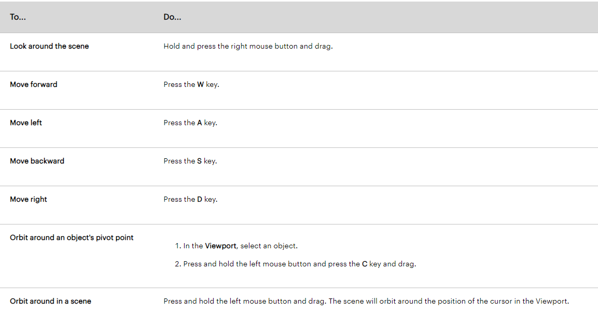
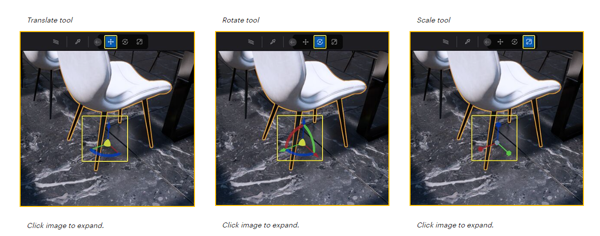
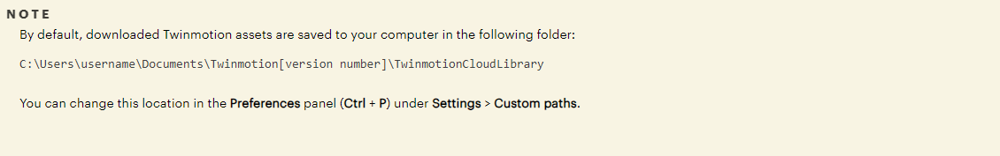
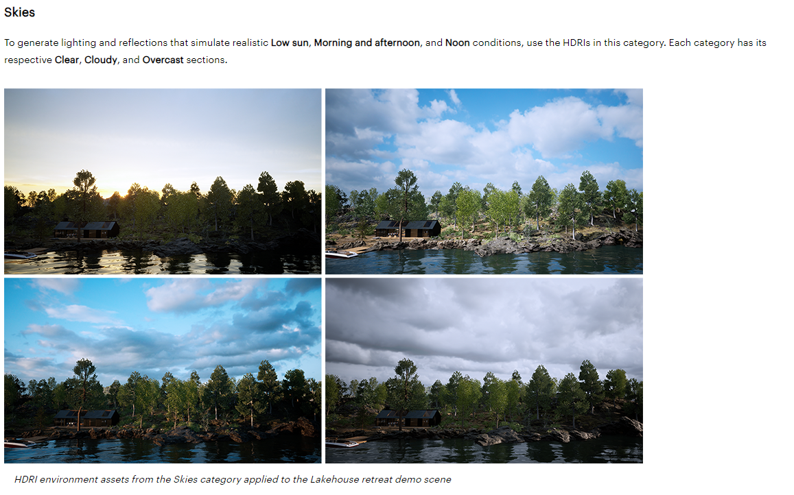

# Summary

| Date  | Notes
| :---- | :----
| 06/01 | Whole Teem meeting, Installed necessary software on lab computer, acquired webcams, watched fastai video.
| 06/02 | Zoom on how to use UE with Anjali and the team, Followed OSC video, set up mambaforge, started reading twin motion documentation, wrote the report

# Activities

- Met with everyone and discussed plans for the Summer
- Went to ITS and got webcams for the lab computers
- Followed Anjalis's instructions for downloading necessary software for the lab computer
- Watched the fastai video, learned how to use the fastai hpc, and created gitea account
- Followed along in the Open Sound Control in UE video 
- Downloaded protokol to help troubleshoot
- Learned how to write the reports through visual studio code
- Started reading the documentation for twinmotion

## Figuring out TwinMotion
- Read the Quick start guide explaining the different areas on TwinMotion's interface

*some useful controls:*

*useful tools:*

*helpful information as to where assets are downloaded*

*useful tool in generating different lighting conditions that can affect our simulation and model to help with generalization*

# Issues

*Solved*
- Computer speaker's weren't working and when I first tried to launch Unreal Engine 5 I got the following error:

- I found that the GPU wasn't even being detected by the computer in the first place and was instead using microsoft graphics.
- Prof Clark helped me troubleshoot and we decided to install and update the necessary drivers for the NVIDIA quadro p6000 through geforce experience. This instillation of the gpu drivers actually ended up fixing the audio on the monitor as well.
- While following along in the Open Sound Control Video I got the following error:

- With help from Prof Clark we fixed the first error by deleting a copy of the blueprint I had originally made and then connecting one of the nodes on Bind Event that was not connected.

# Plans

My main plain for the upcoming week is to:
- follow a TwinMotion tutorial that teaches me how to model a room or something similar
- Take pictures of the lab and try to model in TwinMotion
- Watch fastai video 2
