# Summary

| Date  | Notes
| :---- | :----
| 06/05 | Whole Teem meeting on tasks for the week, kept working with model of ARCS lab in TwinMotion, learned about soldering and some electronics, updated report for today's part, had another whole group meeting
| 06/06 | Whole team meeting on using twinmotion and the differences between it and UE5, read the articles on pair programming, read the lab's previous research papers, tried exporting my twinmotion model to UE5, worked on creating my own AI model following FastAI video's
| 06/07 | Continued Reading FastAI documentation, following along with the next video, and building my first ai model, I then tried using our own dataset to build a model
| 06/08 | Continued Reading FastAI documentation, I went more in depth with our own datasets, tried different models that FastAI offered and compared their accuracy

# Activities
- Had a whole group meeting where we discussed our responsibilities for the week.
- Continued exploring TwinMotion and modeling the ARCS Lab.
- Explored the electronics side by attempting to get a DC motor working.
- Continued working in TwinMotion exploring it's features and limitations.
- Had another whole group meeting where I talked about my experiences using TwinMotion and my thoughts on it as a modeling software.
- Continued working with FastAI and reading its documentation
- I watched the second video in the playlist.
- Followed along to the video
- Created a simple model to determine shoes and their brand https://huggingface.co/spaces/Francis10/minimal
- I used the mapping dataset and tried creating a model from it
- I used multiple different datasets some which didn't work due to being unable to correctly break down the path's to train my model
- Read fastai documentation on vision augmentation and worked with the MuddHallway dataset and attempted to build a model from 2ndHighRes and test it with images from MuddHallway
- I got the model to predict what direction we needed to go, but was unable to properly export the model

- Wrote my weekly report

## ARC Lab in TwinMotion Continued

- A helpful video when starting in TwinMotion https://www.youtube.com/watch?v=QyjifEilI9A

- I continued modeling the lab, this time focusing on the main lab room and Anjali's office

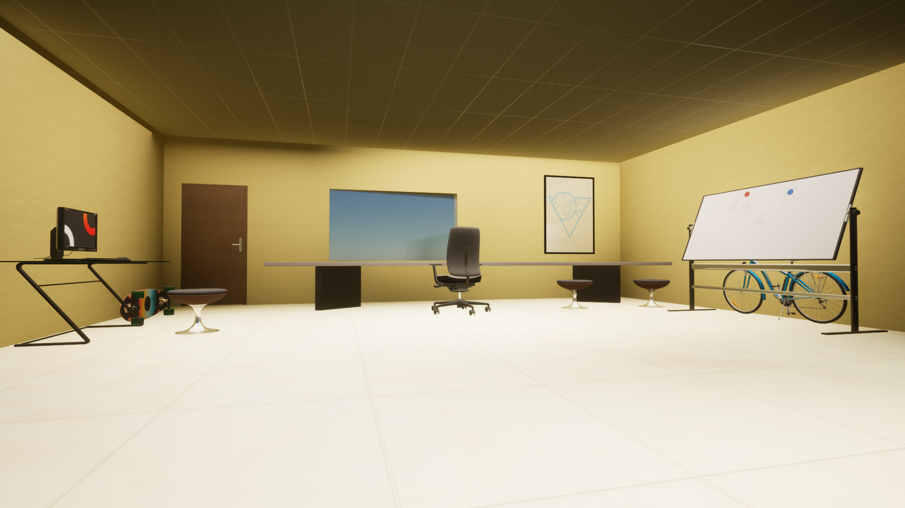

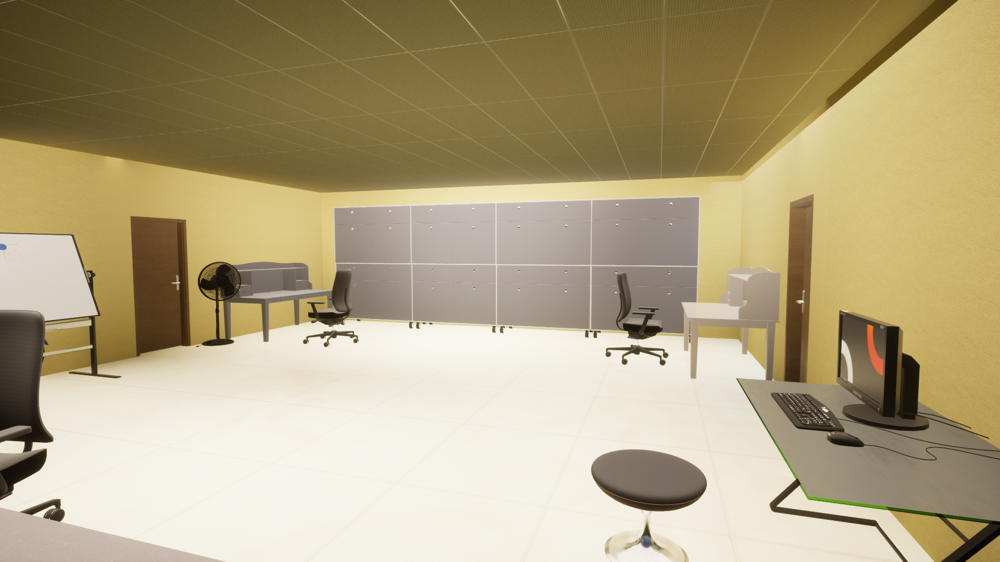

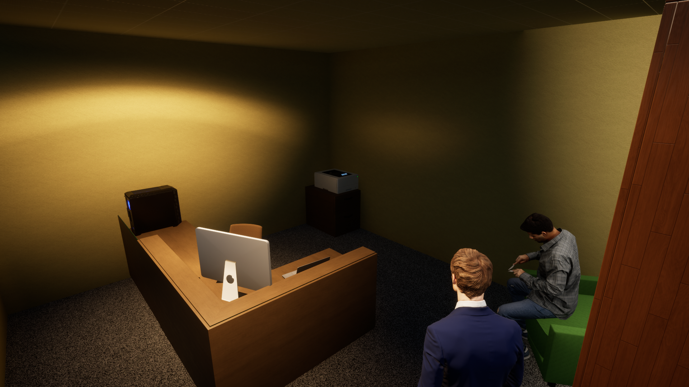

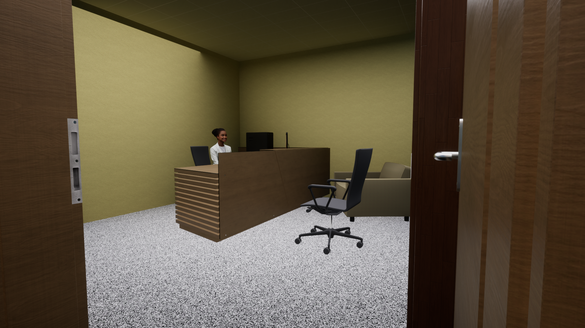

- Below I have attached a video that shows the entirety of the lab

- After finishing my model I attempted to export this model to UE5
- In order to do this I had to export it as a Datasmith file 

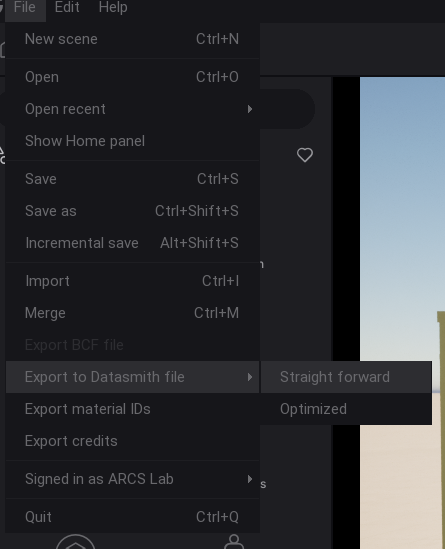

- I then had to install some plugins for UE5 to even allow me to import these types of files

- However, it turns out the plugins were only available in 5.1 UE so I had to install it, in order to import the ARCS lab model

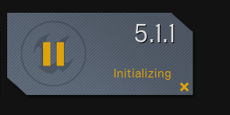

- After importing, the lights were non-functional and there was no simple fix. According, to the web it was a known issue that lighting may break when importing from DataSmith files

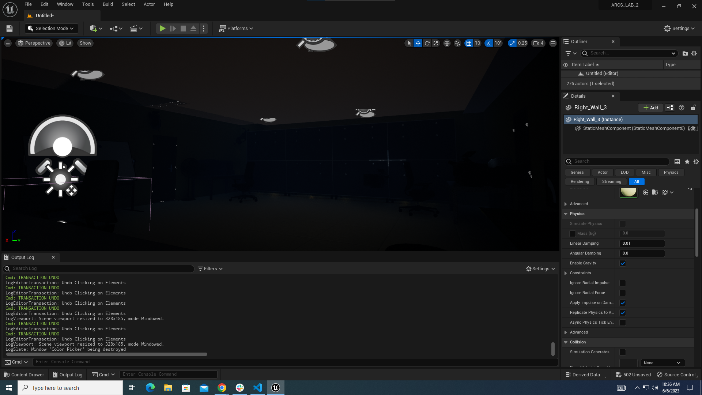

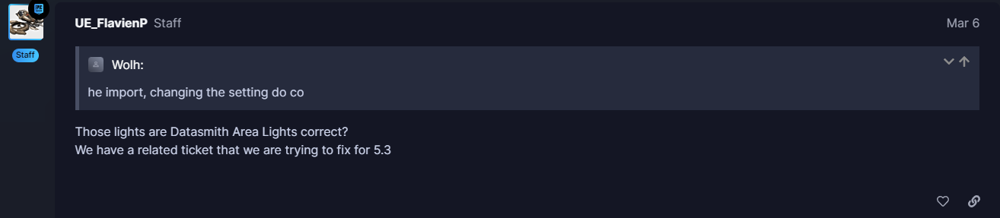

## Practicing with FastAI

- I decided to follow along with the video and try both projects from part 1 and 2 so I could familiarize with the package

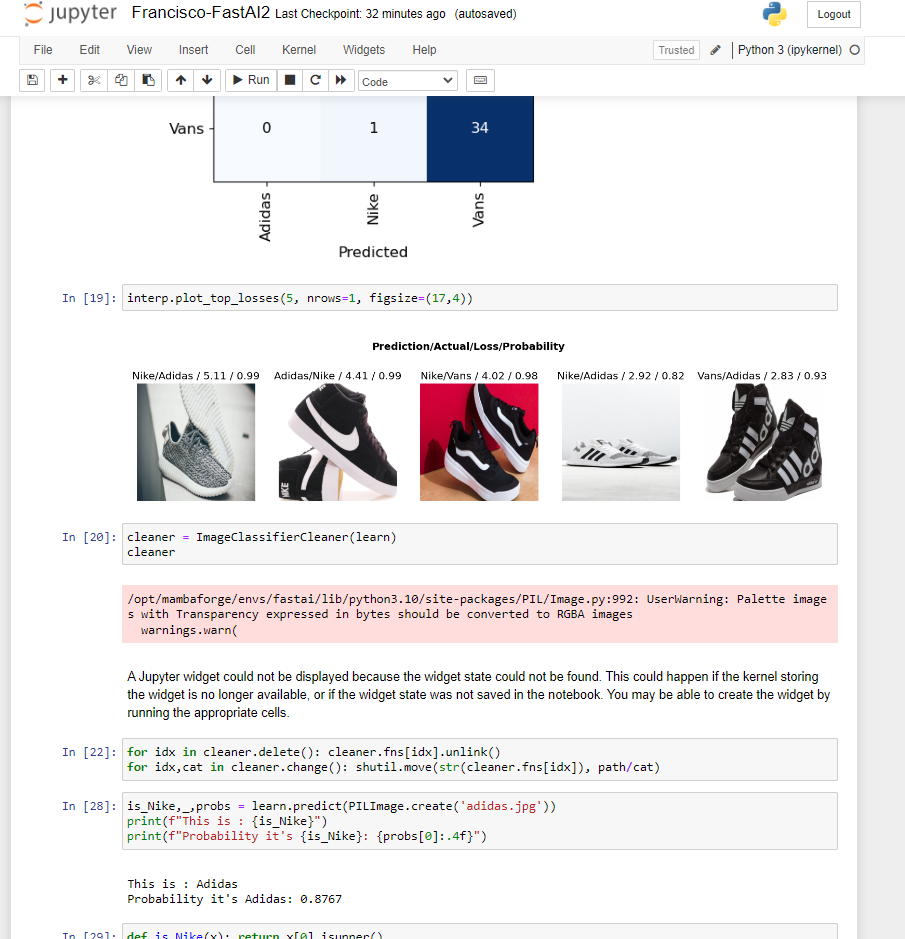

- I then built a page for it that allowed me to test other images from the internet, to understand where my model failed

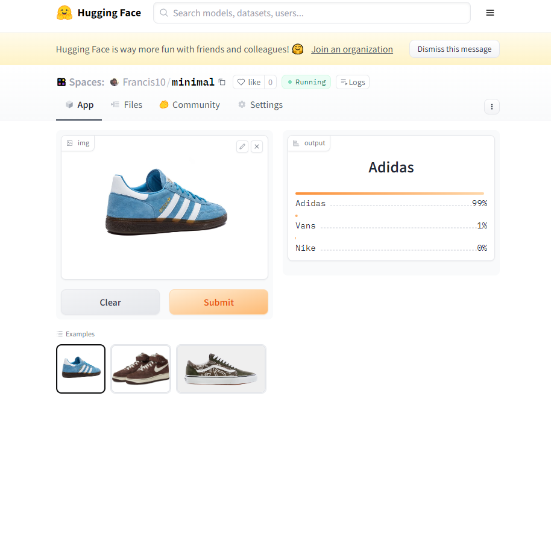

- I then used the /data/clark/data/Mapping dataset to attempt to build my own model. This is what my code ended up looking like before training it fully.

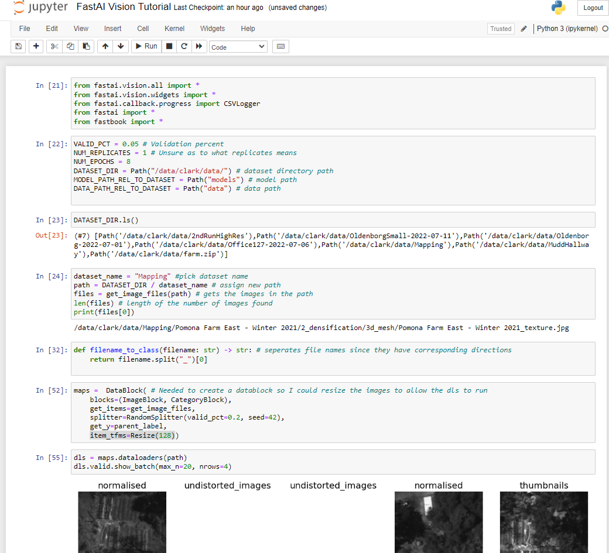

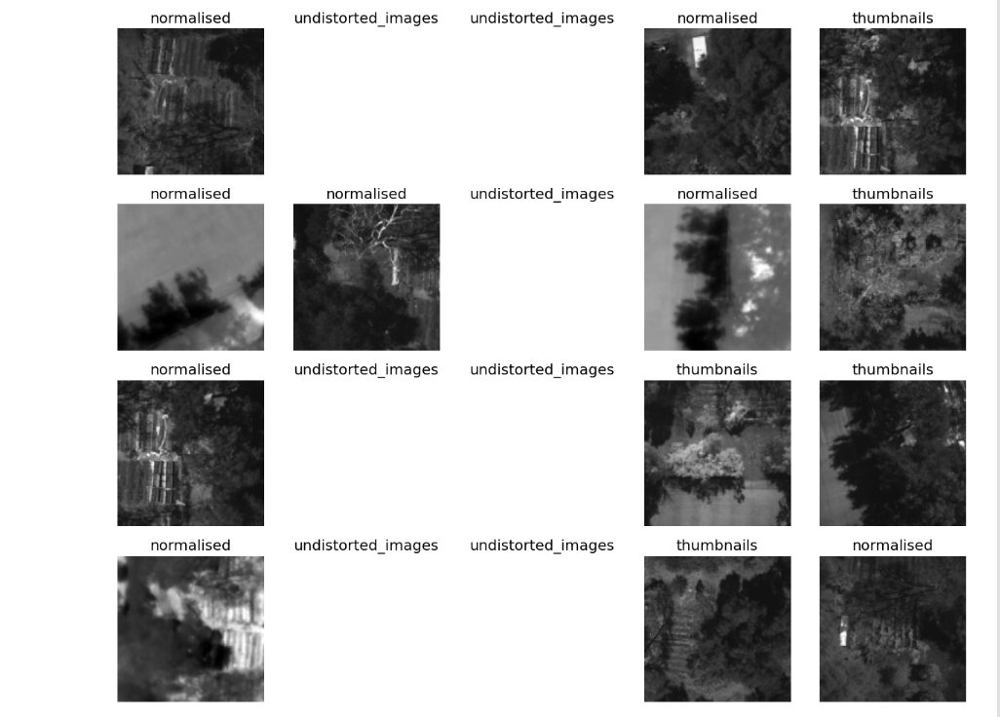

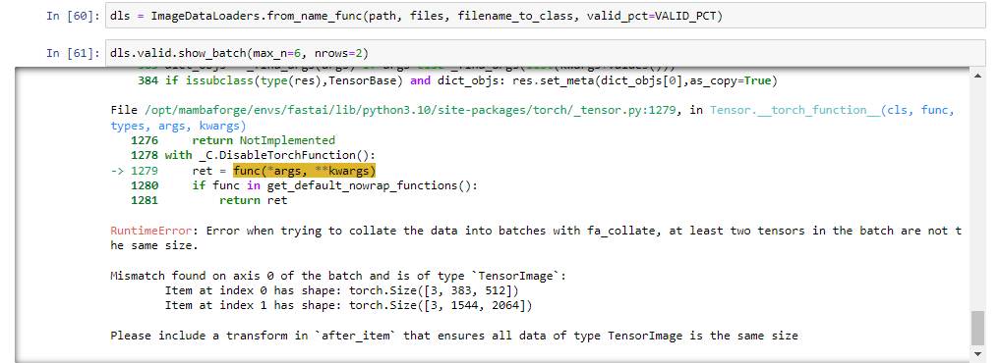

- Continued work with making models and reading the previous years datasets
- I stared exploring the MuddHallway dataset and used the documentation on aug_transforms to rotate the images since they were oriented in the wrong way. I thought this would be a good dataset to feed a model and test whether it could correctly decide what command based on the 2ndRunHighRes

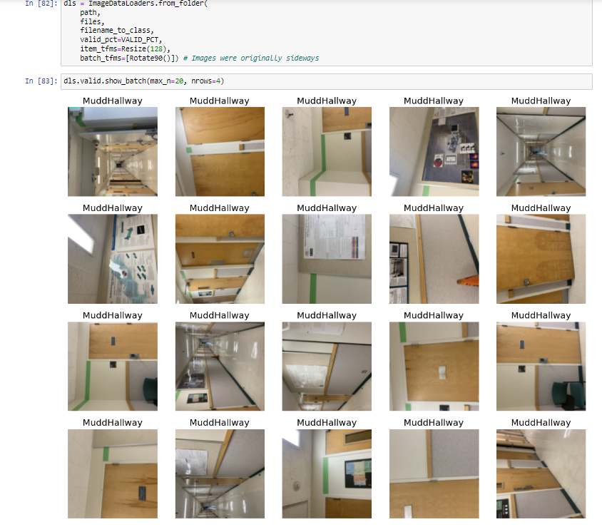

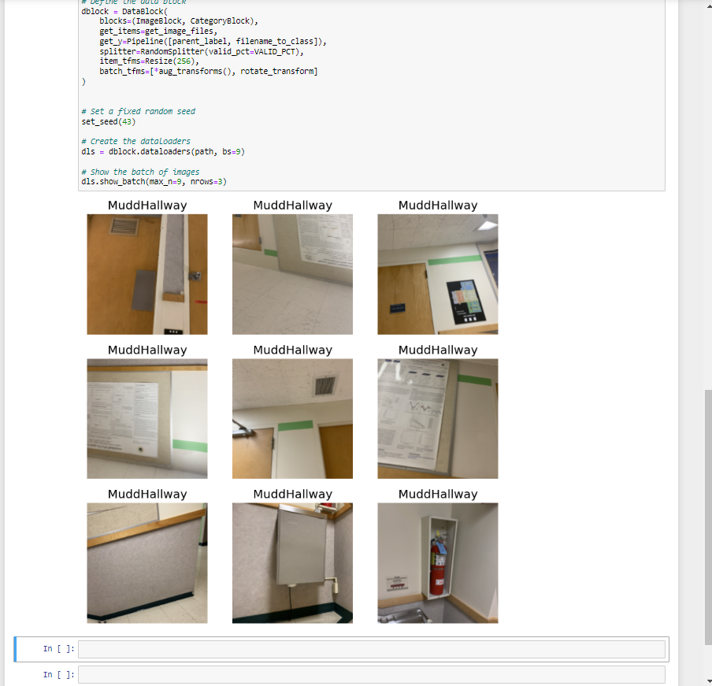

- I began comparing 3 different models that were shown to have the best results in *Investigating Neural Network Architectures, Techniques, and Datasets for Autonomous Navigation in Simulation* and found the resnet50 had the best results, but took the longest in my usage of 2ndRunHighRes

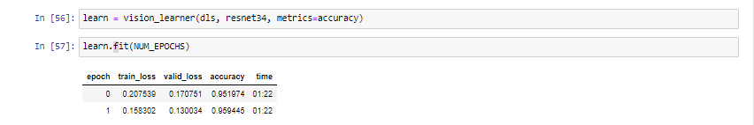

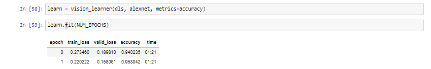

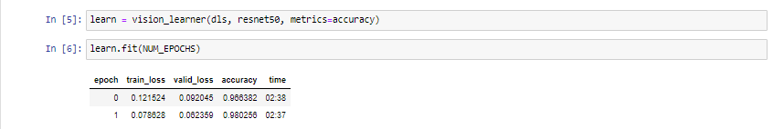

- I finished the model, cleaned the data, and helped categorize some decisions it had made which were made wrongly with a high confidence interval.

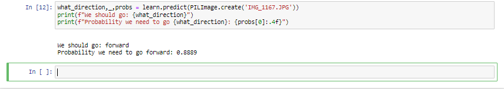

# Issues

- TwinMotion does not allow for one to edit geometry or make fine adjustments

- Inability to clearly edit objects in a group after some time

- Meant to be used along with a CAD software

- No easy way to export and import between TwinMotion and UE5
- Visual Studio Code wasn't recognizing my interpreter, but I ended up using the server with an ssh extension

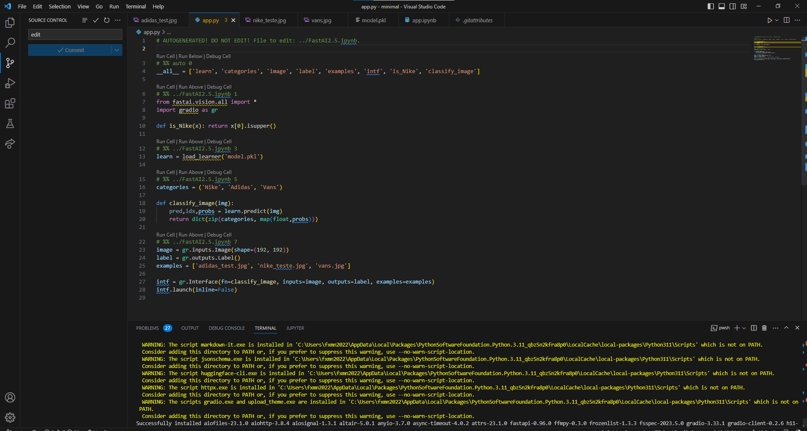

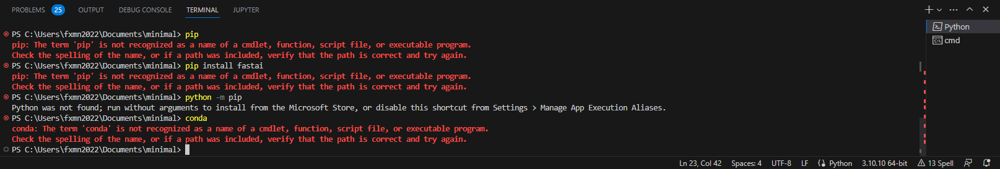

- was unable to rotate the images in MuddHallway to get an easier view and realized that dls.valid.show_batch() actually didn't allow for aug_transforms(Rotate(p=1.0, draw=90)) to work

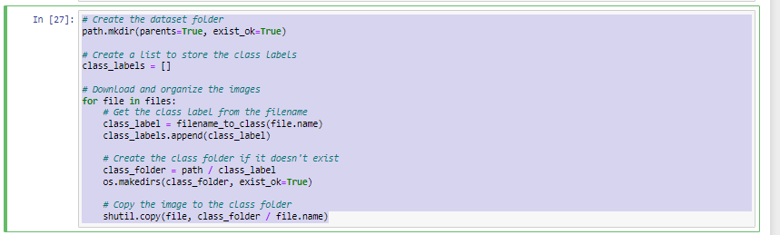

# Plans

# Readings

- Read *Investigating Neural Network Architectures, Techniques, and Datasets for Autonomous Navigation in Simulation* and *Searching for Problematic Simulation Conditions*

- We have a focus on bridging the gap between simulation and reality while making sure we collect data from a variety of sources so we can ensure generalization works appropriately 