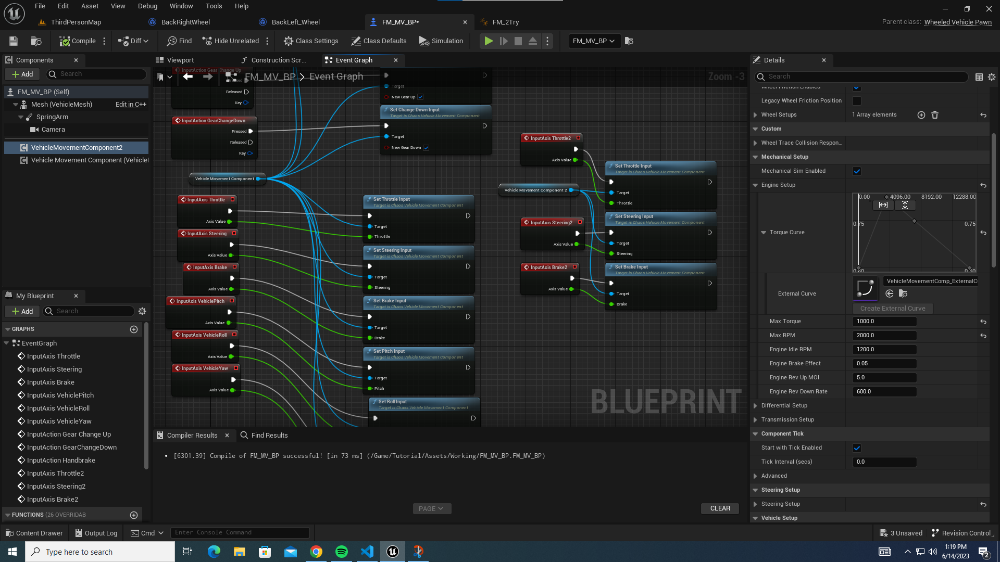
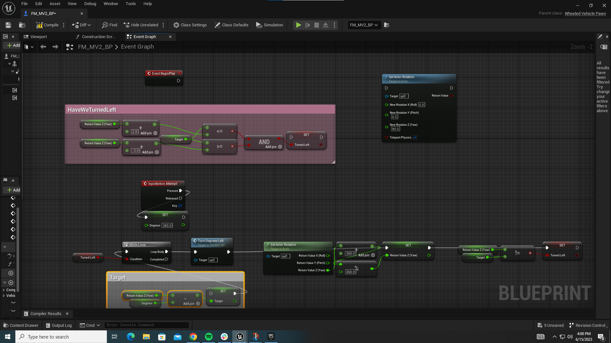

# Summary

| Date  | Notes
| :---- | :----
| 06/12 | I continued trying to fix the collision of the mesh, got all assets on the robot as intended, followed chaos tutorial videos, created the needed blueprints and had to mess around with the Inputs for a while because it was not allowing my simple robot to move, and I eventually got the robot moving.
| 06/13 | I continued researching and watching videos on making a blueprint to control the wheel separately, helped Anjali finish setting up a simple chaos vehicle, downloaded the Oldenborg model and tried to get it working, watched fastai video 3, and looked more into depth into some of its definitions. 
| 06/14 | Whole team meeting where we discussed our progress from last week and the past few days, showed off our working chaos vehicle, created new blueprint that allowed for our wheels to be able to move separately, collaborated with Anjali to fix bugs, talked next steps with chaos blueprints with Proff clark, and started working on a way to stop wheels from rolling on inclines
| 06/15| Worked on getting the wheels to stop moving on the incline and was able to succeed, learned how to change the pawn's rotation instantly to any direction we want, met with the whole team to discuss Chau's working image+command code, and continued working on blueprint to enable consistent turning.
| 06/16 | Dedicated the whole day to working on the Unreal Engine Blueprint, accomplished consistent turning, watched blueprint tutorials, helped out with exporting SweetHome 3D files into Unreal Engine, and was able to get OSC messages to run commands on our chaos vehicle

# Activities

- I fixed the collision and static mesh of our robot
- Followed tutorials on getting a chaos vehicle moving
- Debugging blueprints and getting the vehicle working properly
- Helped Anjali set up a chaos vehicle
- Attempted to import Liz's Oldenborg model but failed
- Watched FastAI video 3
- Read more documentation over topics discussed in video 3
- Researched how to get differential drive in vehicles
- Explored the idea of creating my own blueprints, but quickly shifted away from that
- Looked through forum posts and youtube videos
- Had a whole team meeting where we discussed our progress from the past week.
    - Showed off the working chaos vehicle
- Created a separate blueprint and component for the left and right wheel to be able to move separately
    - remapped another set of buttons to be used for the left wheel by itself
    - Helped Anjali debug her blueprint and get to the same point
- Met with clark and discussed next possible steps for the blueprint
    - I started working on a way to get the wheels to not move on an incline/coast.
    - Was able to stop this from happening by changing the mass of the body/wheels, and calling the handbrake action after each input
- Met with Chau and the team where we learned dicussed Chau's code and got some insight as to what we should push for next in order to be able to start collecting data and training our model.
- I worked on our chaos vehicle blueprint in order to allow for consistent turning regardless of the surface that we are on and finally got it to work with user input.
- Helped Anjali with sweethome 3d exporting by exporting to blender as an obj file and from blender getting a fbx file into unreal engine.
- I continued working on the blueprint and was able to get OSC messages to be able to control the robot in the way that we want it to move.

## Simple Robot Continued
- I continued fixing the collision and the static mesh of our simple robot and finally got it working and on the floor as intended.
- Regenerated the primitive shapes to avoid collision on empty air

- Continued following the tutorials and got to the point where I finished watching along. However, the blueprint would not work with my controls. 
- I looked for solutions and found a tutorial which recommended using the third person controls so I downloaded them and used them as a reference for my blueprint.

- Tried using gamepad in case it was the keyboard input which was not working; however, the problem persisted.
- I finally fixed the issue by restarting my blueprint. I was able to get a functioning robot controller that worked. 

|  |  |
|:------------------------:|:-------------------------:|
| | ||
|  |  | 

- I then tried focusing in making this blueprint work in a sort of tank tread style
- I looked up tutorials in blueprints to become more comfortable with them and create one of my own for differential drive.

|Left Wheel Blueprint | Right Wheel Blueprint |
|:------------------------:|:-------------------------:|
| | |

- I then started working on events we could call to always turn left/right or go forward. While doing this I created new custom events that helped me keep track of the robot's rotation according to the world and a handbreak event to stop us from rolling down inclines after moving.

- I then tried creating a blueprint that always turns an exact amount in order to mimic what we would need to do when our model gives us directions. 

- After completing this, I then began implementing this in a way our blueprint could work alongside OSC and be consistent with its movement.
    - Below I have included some images of early code attempting this

| | |
|:------------------------:|:-------------------------:|
| | |

- On Friday, I dedicated my whole day to getting the blueprint to work. However, early on while trying to accomplish consistent turning with a while loop I kept getting stuck in an infinite loop. Seen below:

    - 

- To solve this issue I created a debug function that would print out the necessary information that might've been causing the infinite loop.

 - After a lot of trial and error without success, I shifted my approach and started to look as creating custom events that would run based on the tick once a user activated a flag that would turn a bool true and cause the robot to turn. These custom events were extremely helpful and allowed me to stay a lot more organized with my blueprint.

- After running this blueprint, I noticed it was working unless I was trying to turn left more degrees than what my target was expecting. This would result in my target being negative causing the robot to rotate for ever because all the possible rotations are positive. In order to fix this, I added an event to the tick that ensured that everytime target is updated if it's negative we are to add this value to 360 to get its positive counterpart.

- I then began focusing on getting these events and blueprint working alongside OSC. I created two new events one that created an OSC server to even allow me to send commands and the other which checked what command was sent, how many degrees we should turn, and calls this action into place. 

- For some time I was struggling to get the OSC commands to actually control the robot until I realized I was setting variables up in the wrong order. Once I fixed this, OSC was working for the most part since I still need to fix an issue where the first command is ignored.

## Attempt at Opening Liz's Oldenborg model
- I downloaded the whole repository and then tried directly importing that folder into unreal engine 5.
- However, I kept getting so many errors that were easy to fix with some installation and restarting my computer.

|Errors I got | While trying to import | the Oldenborg map |
|:------------------------:|:-------------------------:|:-------------------------:|
| | ||
| | ||
| |  

# Issues
- The wheel of my simple robot asset kept disappearing 

- Engine Input is now deprecated, so I thought I had to find out how to use the new enhanced input actions to use chaos vehicle; however, I got the normal inputs working through restarting my blueprint from scratch. 
- Prompted to download Visual Studio 2022 in order to be able to open the project; however, once I downloaded it told me I was missing a necessary component so I installed it, and had to restart my computer.
- It finally compiled but once it opened the whole scene was empty.
- I was having issues with my control inputs not running even after my blueprint showed that the action was being performed. I fixed it by creating another pawn for my chaos vehicle in which I removed InputAxis because it would override whatever input I gave it with throttle 0.
- Struggled to get the chaos vehicle to consistently turn the same degrees based on whether it was on an incline or flat ground.
- I'm currently struggling into finding out why the first command is ignored and then starts working perfectly.

# Plans

- I plan to work on making an image+command model in order to get more familiar with the tools that we will be using.
- I need to work on the camera that will be at the front of the robot and take pictures and export them into a folder on our computer.
- I hope to continue working and getting all of our files meaning chaos vehicle, blueprints, and environment set up to be packaged into a game so Chau and Daisy can start collecting data.