# Summary

| Date  | Notes
| :---- | :----
| 06/19 | Worked on the UE5 blueprint and fixed a lot of the bugs that we had, tested more of the OSC utility in unreal engine 5 and learned Anjali couldn't send messages to my UE5, tried to get a working camera taking screenshots of the robot's front view, read through Liz's weekly reports, watched the Weight and Bias videos, rewatched some of fastai video #3, and started working on image+command model.
| 06/13 | Whole team meeting, Demo walkthroughs with Clark, Started working on the python script to communicate with OSC, troubleshot Oldenburg model uproject not opening, read fastai and PyTorch documentation, and kept working on my Image+Command model
| 06/14 | I continued working on my Image+command file and got it working with Chau's help, I started adding the ability to take screenshots in the FullDemo in ARCSDemo, found a way to change the filename as we want, was shown by Prof Clark on how to use terminal commands to change asset textures and also make pull/push requests when forking, and I packaged the game for windows successfully.
| 06/15 | Started looking at the blueprint and understanding how the movement controller works, took measurements with Anjali on Oldenburg, got OSC commands working with the blueprint for screenshots, movement, and turning, and packaged the project, packaged it for windows, and mac.
| 06/16 | 

# Activities
- I had a bug in the blueprint that when I interrupt a command while its still ongoing it makes the target degree be incorrect. I fixed this by updating the target degrees as soon as a command is called.
- I was having an issue where turning right would sometimes make it spin for ever. This was easily fixed by making any target above 360 into its equivalent angle between 0-360.
- I then started facing an issue where turning to a certain angle through open sound control would cause it to spin forever, this was fixed by adding a set bool statement when is a command is called that allows for the check to see if were are done turning to be checked every tick and stop us when needed.
- I then had Anjali see if she could send commands from her machine to my unreal engine, but she was not able to. I put this to the side, so I could Ask Clark tomorrow during our whole team meeting.

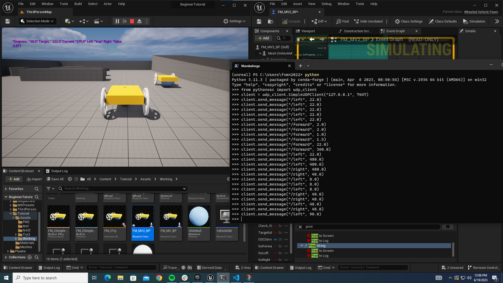

- I tried looking to ways to take screenshot of the front of the robot's view, but I am currently struggling without setting it up in the level blueprint. Anjali found a way that does it through our normal chaos vehicle camera viewport, but I don't think we can specify the filename with this so I'll keep looking into ways we can do this.
- I watched the Weight and Bias youtube videos
- Rewatched some of fastai video #3 
- I looked through Liz's github reports from last year to see how they tackled taking images in unreal engine, but didn't find specifically how they accomplished taking the pictures.
- I then started on making an image+command model that works on 2ndRunHighRes

- We had a whole team meeting where we discussed our progress from last week, Clark went into further detail for our goals in the next few days, and specific details over OSC. 
- Installed the extensions that were recommended, and tried signing up for GitHub Copilot.
- Me and Anjali then peer programmed to get OSC working through the python script and were able to get it working on my computer.

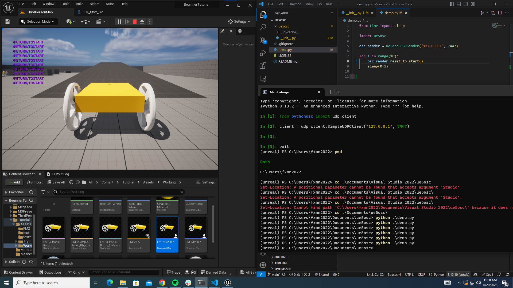

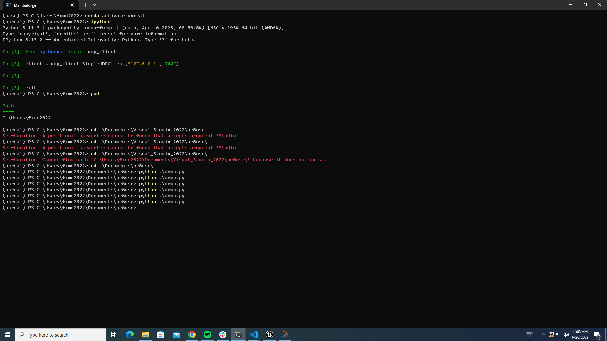

- I tried opening the new update on gitea for the Oldenburg model. However, it was still not showing anything.
- Clark helped me fix this issue by allowing cloning directly from gitea which made the uasset files get cloned correctly. By just trying to download without following proper procedure the uasset files wouldn't correctly download what was needed to run in unreal engine. 

| Error Downloaded Uasset | Correct Cloned Uasset |
|:------------------------:|:-------------------------:|
|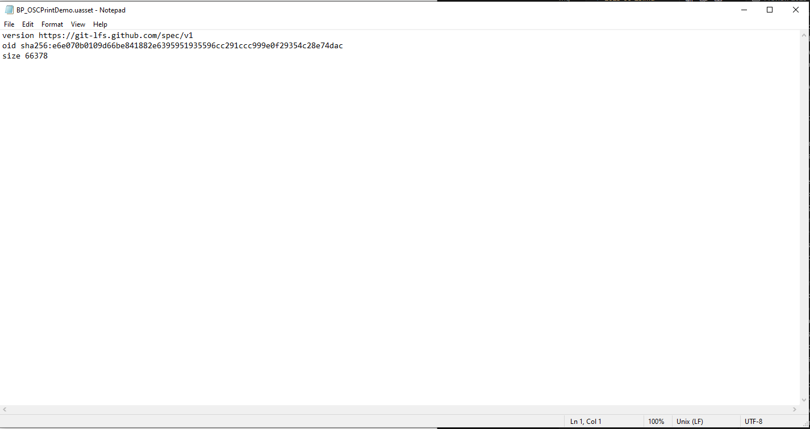 |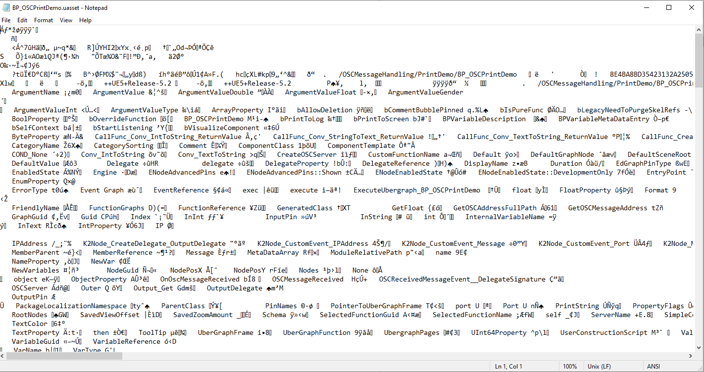 |

- Me and Anjali then went to Oldenburg and started collecting measurements of all the floors, ceilings, and walls for scale.
- I then went back to working on my Image+command and finished writing it, but got 2 errors.
- I started debugging my Image+Command code, as every time I fixed one error another one would pop up. I was able to fix a lot of my errors by reading through Chau's weekly report and seeing how she was able to accomplish it..
    - Below I have some errors my code got before finally working

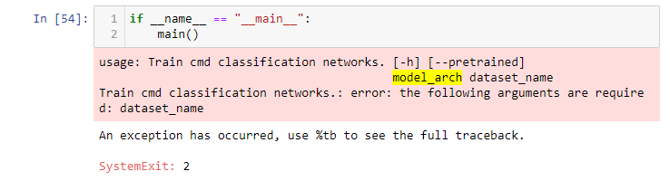
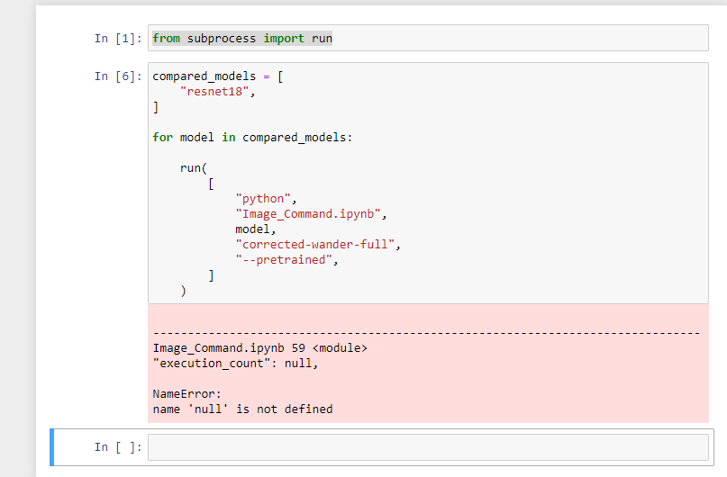
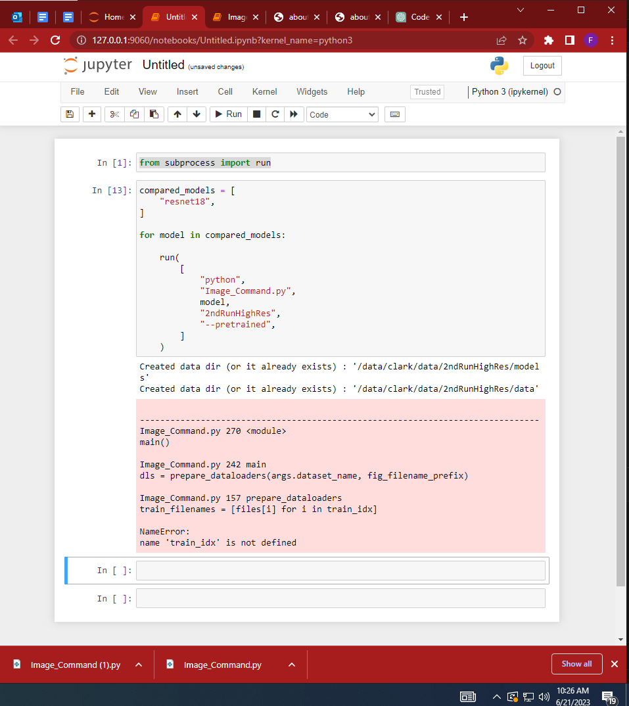

- I finally got my own code working when I exported the model as pth instead of a pkl since it was giving me a permission error

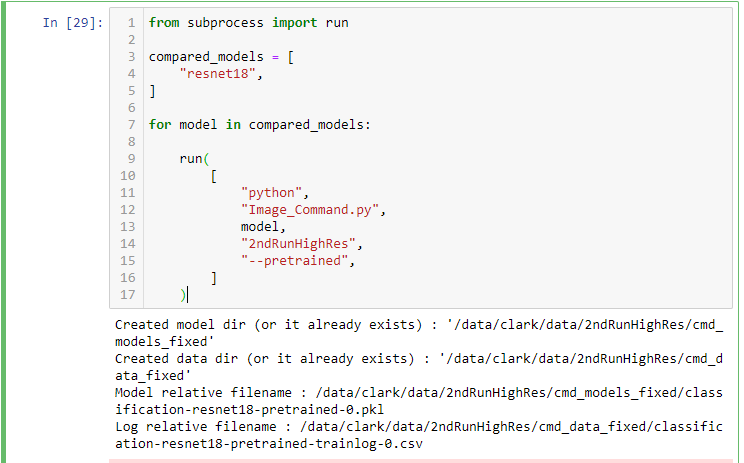

- After fixing the error, I started to work on adding user controls for taking screenshots. I then spent some time looking into how we could change the name of our screenshots as highres screenshot had some issues allowing custom file names.
    - If I tried using the filename pin our image would just be overwritten by the most recent one we took. Anjali found a possible solution with Take Gameplay Automation screenshot which did take screenshots with unique custom names; however, each image would just be a white screen.

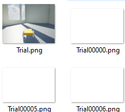

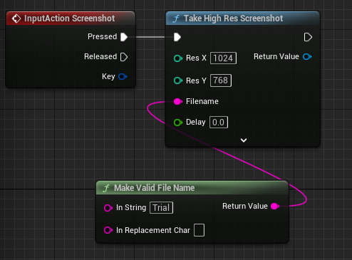

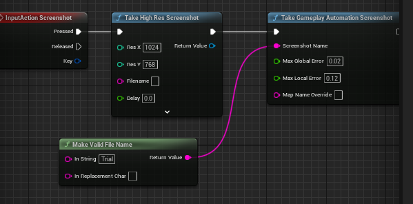

- We solved it with a counter that was appended after the custom name that we wanted. This counter was updated each time we pressed the button for a screenshot

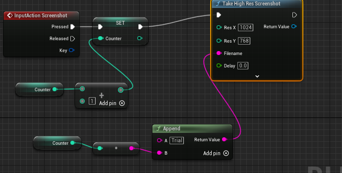

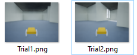

- Prof Clark then came into the lab and helped me and Anjali figure out how to use in game terminal commands to change the materials of the Oldenburg model.

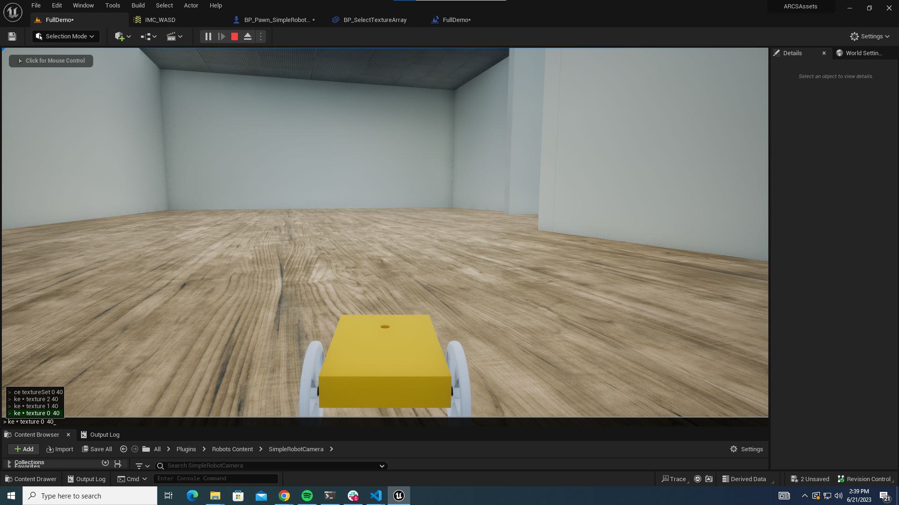

- We were then show how to setup our python to osc file through github by making forks, pull requests, and reviewing our pull comments. 

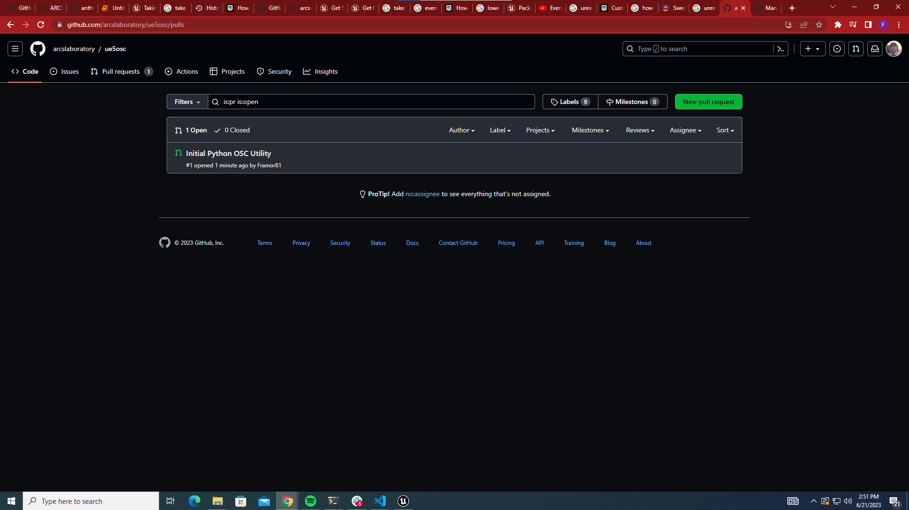

- I started on packaging the game for windows and got it working pretty well. I added a few features where it starts on windows and the resolution is lowered to 1024x768 on launch. This was done by on beginplay we run console commands that do so for us.

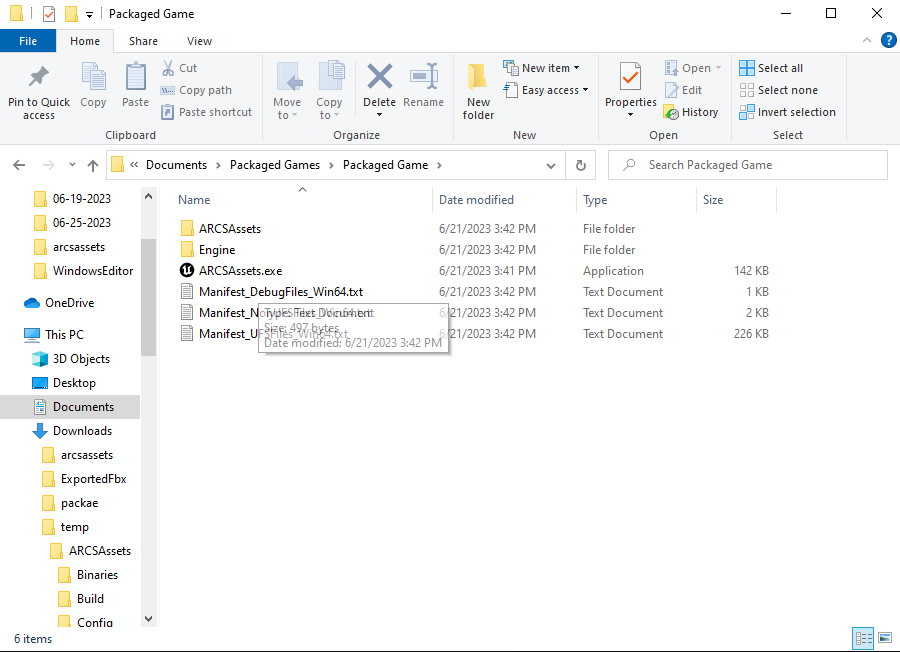

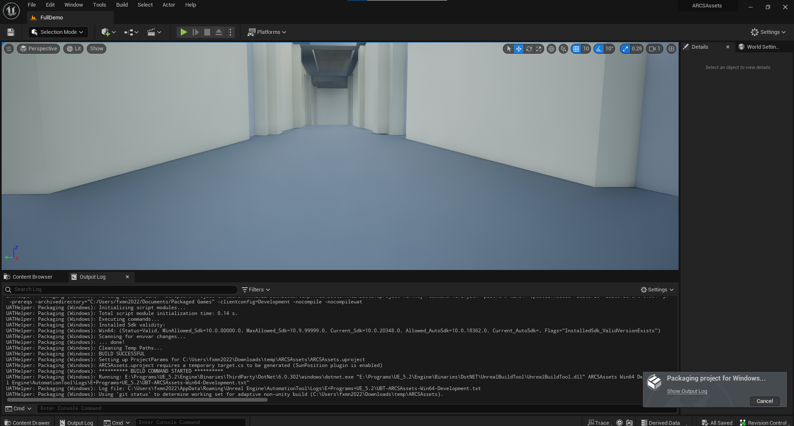

- Worked with Anjali do take detailed measurements of Oldenburg
- I then looked through the blueprints already in the demo to see what we could add and change.
- Started adding osc commands to allow the robot to move, reset to start, and take screenshots.
- I was having some issues with coming up with a way to decide how much to move forward, until Clark told me how I could approach this issue by simply adding the value into the actor local offset.

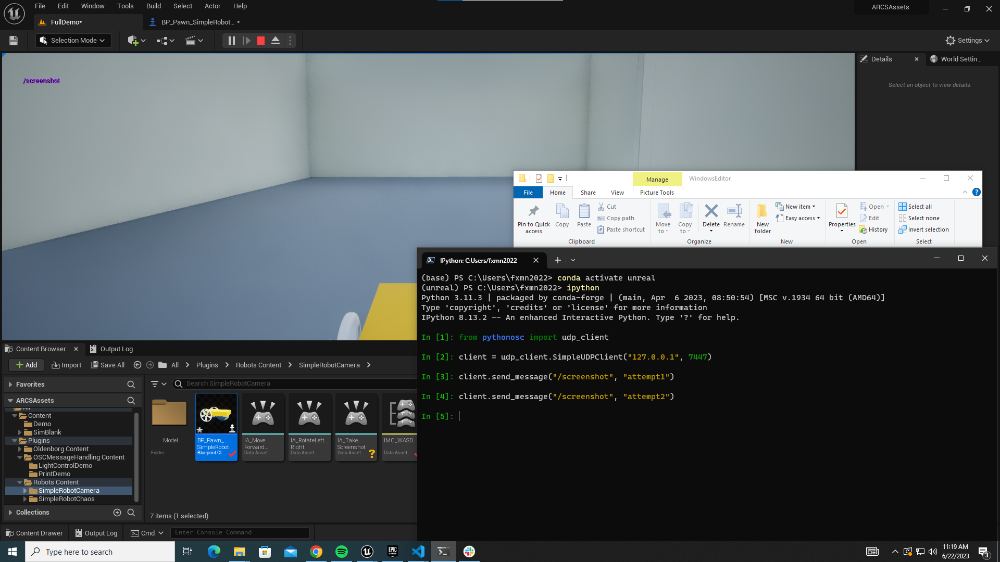

- I finished constructing all the blueprints and getting them working with OSC.
- I zipped the project and packaged it for windows and MAC.

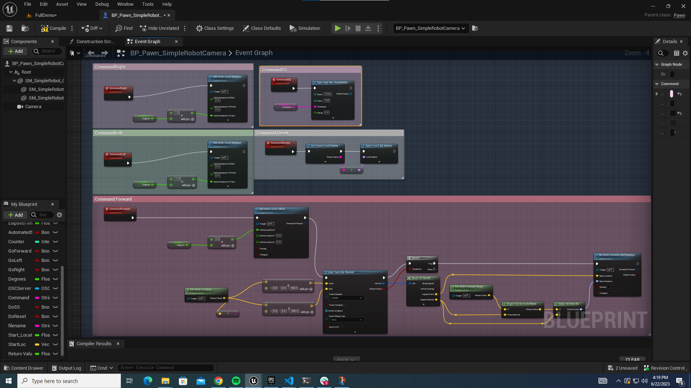

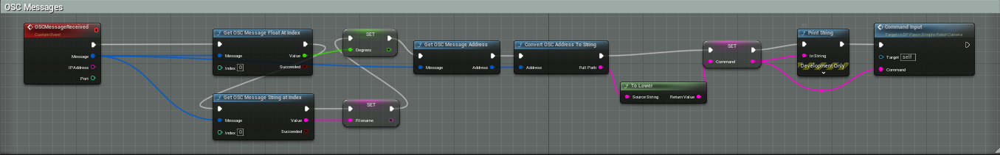

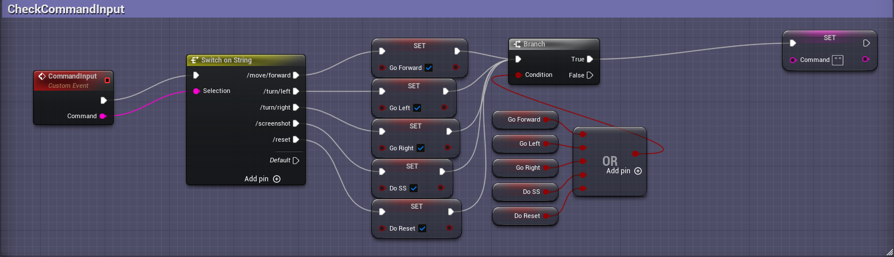

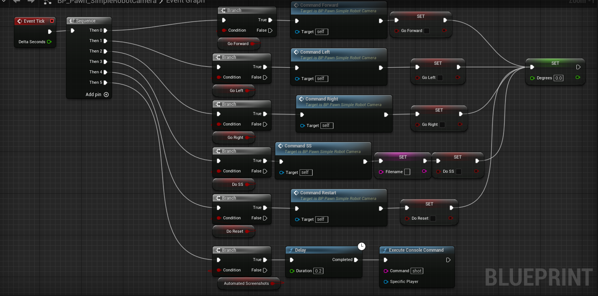

# Issues

- It looks like the commands are one command behind when given a degrees to rotate. I fixed it by reorganizing the order of execution of the OSC messages. I made it so degrees is called first and then right after it'll execute the command, just to ensure no errors arise.
- Robot would keep turning left on inclines because gravity would pull it and the tick would miss the moment in which our target = our current angle. I fixed this by getting rid of the tick delay checking our position
- I tried opening the newly updated Oldenburg model, but I got an error
- Downloaded it instead of cloning  and it fixed the issue
- Using Take high res screenshot did not allow for us to easily change the name to a custom one with the filename pin. When used, it would override any screenshot since each one taken would be named the same. To work around this issue we added a counter that added 1 each time a screenshot was taken and was appended to the end of the custom filename.

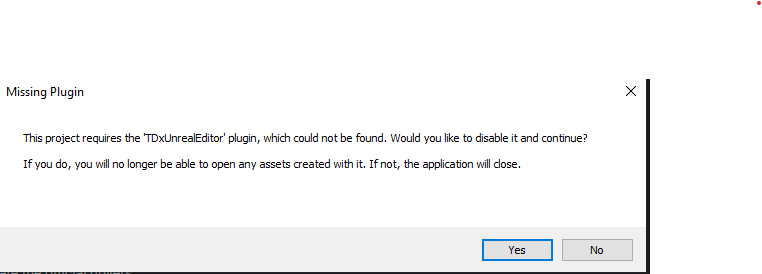

# Plans

