# Summary

| Date  | Notes
| :---- | :----
| 06/26 | I read on OSC servers and dispatchers to try to get unreal to communicate with python, I got some instructions to how I should continue working and got told I should look into boxnav in order to continue approaching replacing ue5env with our ue5osc python script, I finished working on the simple commands for python to command unreal engine.
| 06/27 | I continued working on getting unreal engine to send messages to a terminal, then to python, I fixed some of the code in the OSC Sender __init__ so it would work unreal engine, I created a new python file where our dispatcher would actively listen and return the correct items to the correct place, and I finished all blueprints from the __init__ script. I added comments to my scripts
| 06/28 | I tried out my osc python script and found out that it didn't work, spent time debugging it and getting it to work and communicate as needed, had a whole team meeting where we discussed our progress, met with Anjali, Chau, and Daisy to decide what software we would be using for modeling, and lastly looked more into trying to send images to OSC by making them into binary.
| 06/29 | Wrote SWOT report, debugged python code and tested all funcitons to work as intended, finalized our unreal engine blueprint, fixed an error where screenshots weren't being saved in the packaged version of our game, stopped trying to make OSC itself send a message over to python and instead decided that when the user wanted to run the code they would have to type in a whole path directory to put the file in and then we would access said directory when requesting an image, added an argument parser to ensure this argument is always given by the user, went over how I want to explain my blueprint, discussed with Anjali about next steps in modeling, boxnav, osc, and unreal engine.
| 06/30 | Whole team meeting, learned how to commit to gitea for our uproject, helped Anjali get started with blender, and then focused on tackling the suggestions made.

# Activities 

- I read documentation on OSC servers and found more information about dispatchers, redid some of the python script I had already started working on, and met with Prof Clark and discussed my current plans, some feedback, and got assistance with the direction I should approach boxnav.

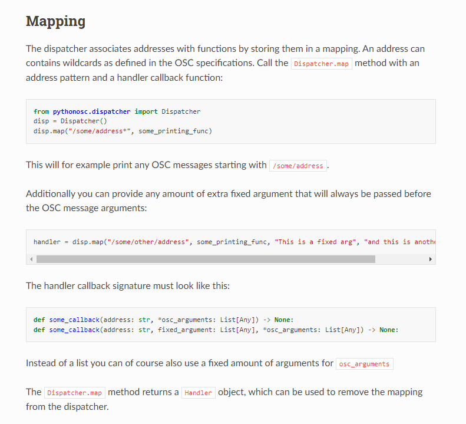

- I kept working on the python file until I got to the request image. At this point I was unable to find an effective way to get OSC to send the image into python for it to be read.
    - This was a lot harder than expected. Currently looking into turning it into a 2D texture, and from this we can create a binary array which when made into a str or tuple should be be able to be messaged to python.

    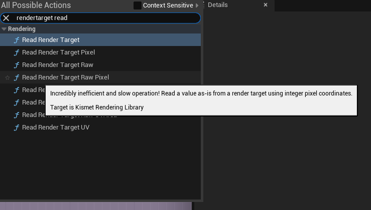

- I finished up the script on the server side from unreal engine, so now once I finish the blueprint, we'll be able to send messages as needed. 
- Worked on the blueprint, but the OSC Client on Unreal Engine's side wasn't sending anything over to terminal or python, so I looked into why this was the case and realized that the ports of the client and server must be different, and  the function doesn't accurately work because the target for sending messages and the client itself aren't compatible as an input to a custom event to fix this I had to delete the old OSC client variable that I had and remake a new one. This fixed the issue.
    - I finished the blueprints and adding all the necessary commands referenced in the original boxnav
- I then tried making demo.py receive information to test whether python would work. I was able to get it to start receiving information, but there are moment where the terminal dies and it doesn't allow me to rerun the code, edit the script, or even kill it. This happened when I was attempting to create a timer for the server so it wouldn't indefinitely lock me out while I was debugging.
- Had a whole team meeting where we discussed our work from last week, we then discussed pros and cons of each modeling software and which one we want to stick to, and talked about plans for the model.
- I then went to Oldenburg and gathered some final measurements.
- I packaged the game for windows and for mac. This new package had a couple of updates:
    - The first of which was I fixed the communication between unreal engine and it's client which allowed it to return data to any server that was listening. 
    - I then created a couple of new commands to work with the boxnav code. These commands are the following:
        - /get/location - returns the current location of the actor
        - /get/rotation - returns the current rotation of the actor
        - /set/location - Input: string "x, y, z" - sets the current location of the actor
        - /set/rotation - Input: string "pitch, roll, yaw" - sets the current rotation the actor
        - /get/project - returns the current name of the level    
- I researched ways to try to send images into a byte array to be able to send it through OSC
- Me and Anjali sat down and I explained my code and what everything did.
    - We then debugged a bit of the code where values weren't being correctly updated. We fixed this by resetting the values to none so the while loop acting as a delay still functions even when it's not the first time calling a function.
- Worked with Anjali to go over OSCSender code and clean up some of it so its more legible while fixing errors in rotation not being what we expect.
- Decided trying to turn an image into a 2D texture and then into a binary array was too time consuming and instead shifted my focus in finding a workaround.
    - Came up with the idea where we check what platform the code is being ran at in our python code with from sys import platform and saving the platform into a variable dir. If it's windows we take the screenshot and save it into the same directory, but if its mac we saved it to it's library directory. This dir variable is then sent through OSC to unreal which runs the console command for HighResShot. 
    - My thought process was by making sure we always send the images to the same place with a common naming convention which will allow us to request the image from the dir we just saved them in. I was able to implement this idea with an if statement that checked your system os, and assigned two different possible paths. One for windows and one for Mac. Clark then recommended I change it into an argument the user has to give through the command line. We added an argument parser to require the user to have to give a path where they want the image to be downloaded. This allowed us to ensure no matter what device you are on the python OSCSender is able to function as intended. 
- Me and Anjali talked about the code and explained all aspects of it, we then commented all parts that were still confusing, and tested out each individual function.
- I then committed the OSC files into github.
- We met and I presented about the work we have done on the unreal engine blueprint. I got feedback and recommendations for what to do next. We then practiced commiting and pulling the project from gitea.
- I helped Anjali get started with blender.
- Anjali and I then decided to tackle the suggestions Prof Clark had made on our python file, which we struggled with a lot.
- We read more documentation on threading and had to troubleshoot step by step when creating the new handlers wasn't going as well as we expected. 

---

## **Unreal Engine Blueprint** 

__Event Begin Play:__ When we first start the simulation or game we have a couple of functions and variables that get called. We first set our camera FOV to be 90, make sure the game isn't in fullscreen, and set our resolution. We then set some default values for some variables we will be using throughout our code being our commands, image counter, and automatic screenshot taker. We then use the OSC library to create a server which is able to listen to messages (Below the first image we have the event on OSC Message Received which calls a function to check what command we fed it when we receive and OSC message), we then create our client which allows us to send messages from unreal engine into python on port 7001. We then create mapping system for our controls.

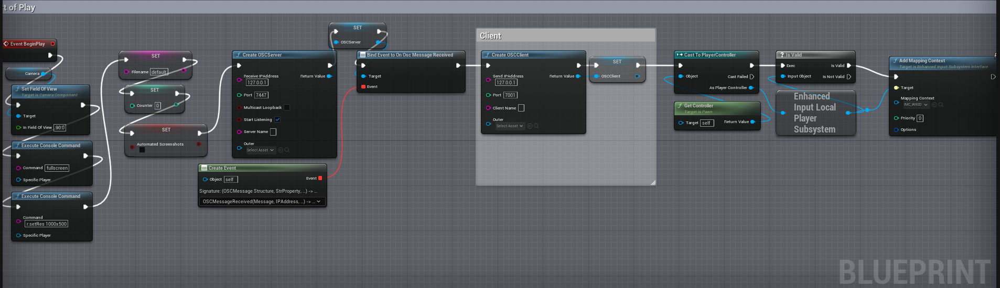

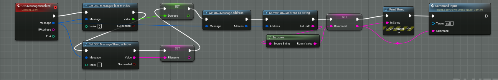

__Commands:__ With OSC we are able to type in certain commands to get unreal engine to perform specific actions. These commands and their input required range from /move/forward (float: Distance), /turn/left (float: degree), /turn/right (float: degree), /reset (none), /screenshot (none), /get/location (none), /get/rotation (none), /get/project (none), /set/location (floats: x, y, z), /set/rotation (float: yaw), /save/image (str: path)

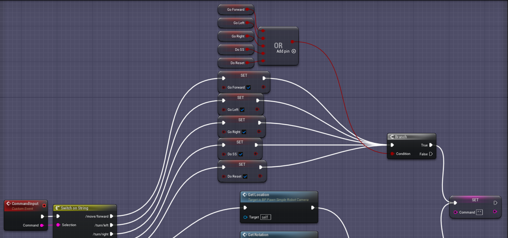

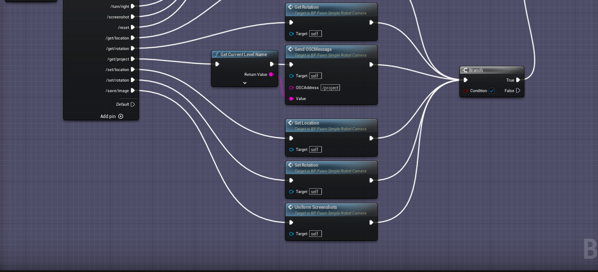

__Check For Command Requested:__ The following code simply checks whether a command was requested every tick, and will then run the requested command before resetting it's flag and variables.

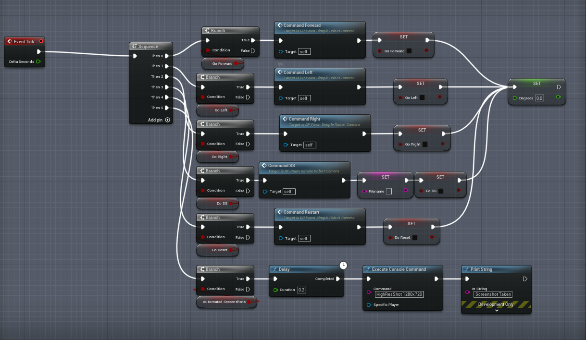

 __Simple Robot Controls:__ In our Blueprint, Prof Clark had already created a simple robot controller which originally was the only thing that was inside the blueprint. It allowed us to move the robot in all directions, rotate it on its z(yaw) axis. Furthermore, it also ensured that the robot was able to calculate when it was on slopes to make the camera tilt down or up and when it should start increasing or decreasing it's elevation. The controls for this original robot control was W & S to go forward and backwards and A & D to go left and right.

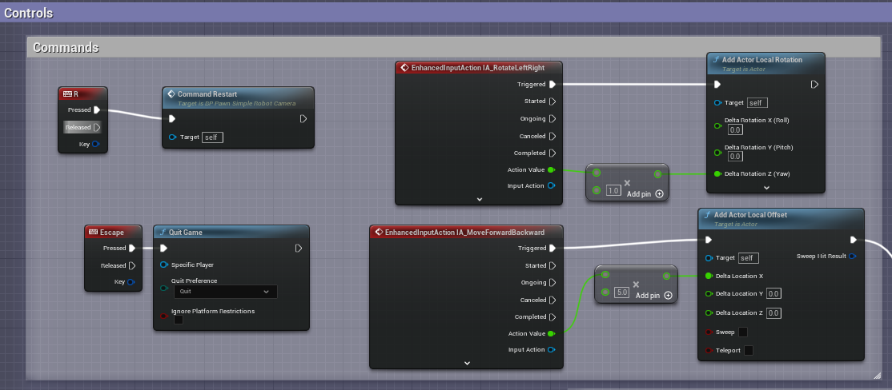

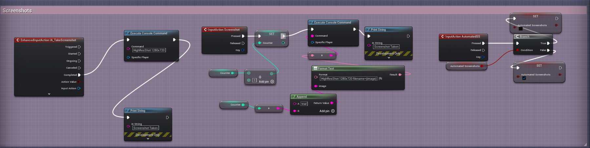

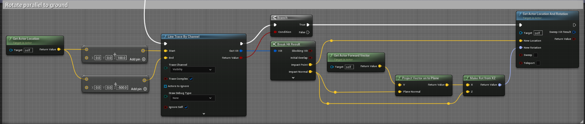

__Helper Functions:__ In order to make the blueprint a lot more legible and and easier to understand I created a numerous amount of custom events to act as helper functions. These functions range from moving our robot, saving screenshots, turning, and getting/setting the robot's locations/rotations. 

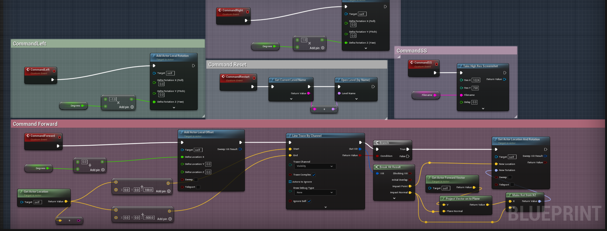

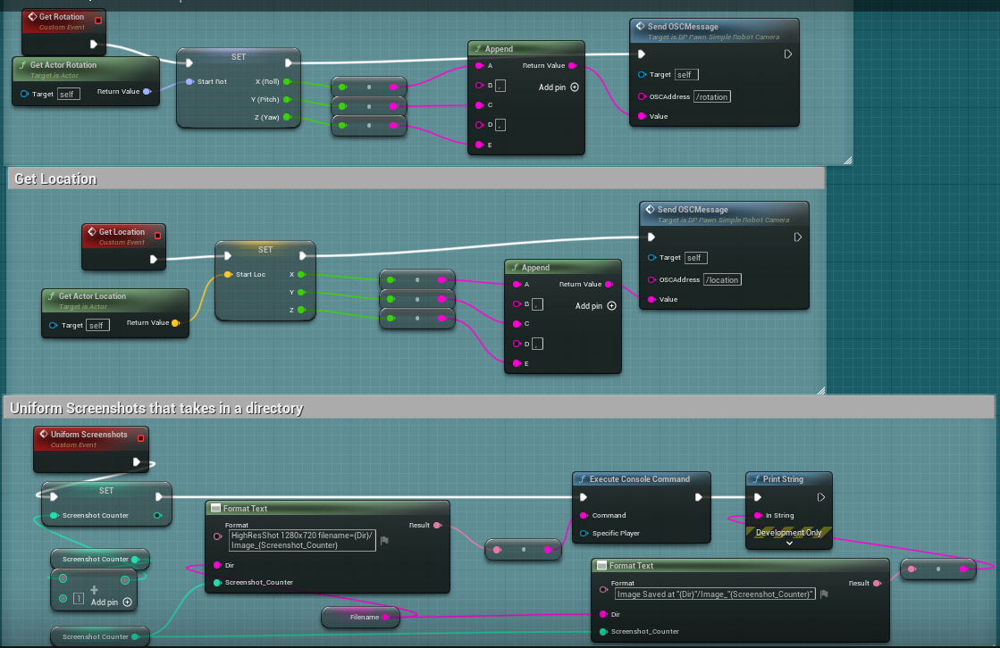

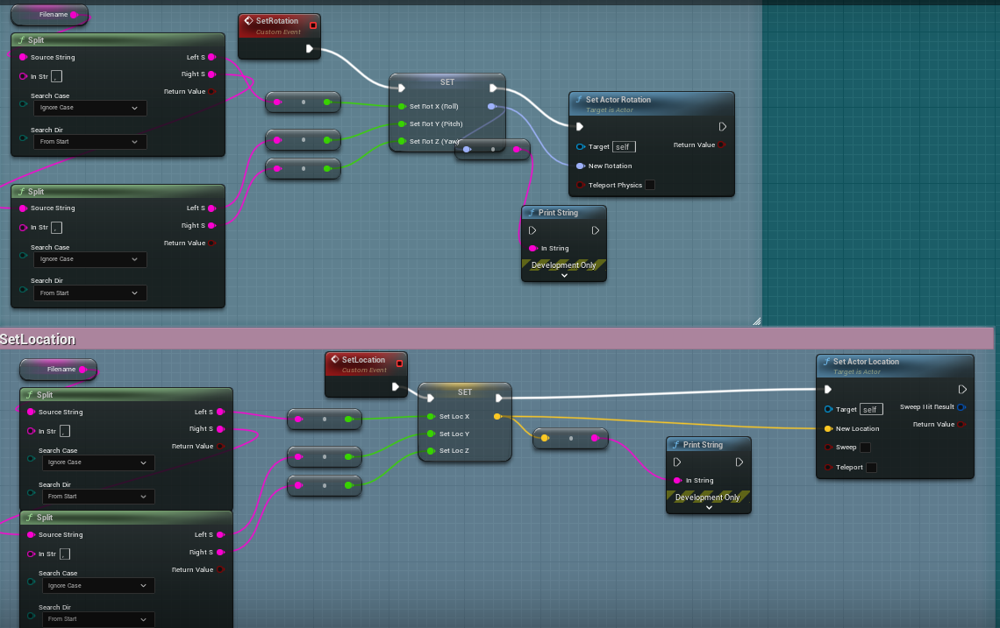

---

# SWOT
- Strengths:
    + list your strengths (relating to school and research)
        + Some of my strengths related to school and research are the following: I am motivated in learning more about stuff even if it means it'll be hard, I tend to do good with managing my time and splitting up my focus, and I am able to effectively ask for help and get confusion cleared up from peers or mentors.
    + list lab strengths
        + Some of strengths in the lab are the following: I have no qualms about the schedule meaning I am on time and work daily, I dive deeper into issues that I think I can solve on my own to push me to become an even better researcher, and I really enjoy the work that we are doing.
    + what makes you/us unique?
        + I am unique in the sense that I have had robotics experience before, but I've never dived into the world of simulations and gathering data. Instead, I have more experience with programming the hardware to move with user input and building the robot itself. Furthermore, I have a bit of experience with bread boards and wiring electronics that I can apply in the future if possible.
	+ what do you/we do well?
        + I am able to work together with Anjali well, I have been able to pretty effectively learn Unreal Engine and get used to it, and we do a good job meeting every week and learning what everyone has done which gives me insight to things I may be doing in the future or that I didn't get a chance to fully understand.
- Weaknesses:
    + list areas in which you can improve
        + I can definitely improve my ability of taking notes of videos, research papers, and documentation. Usually when I read or explore these topics, I tend to read it over and over again over an extended period of time which helps me a bit; however, might not help others who had the same questions as I did. 
    + list areas in which the lab can improve
        + We can improve by working in zoom calls a bit more often where we can get feedback from one another. Like an extended meeting call might help, to get everyone caught up and able to help with some issues.
	+ what slows us down?
        + The fact only me and Anjali are able to work with unreal engine to build the game to collect data.
	+ what could we do better?
        + We could gather all of the reports we have written so far, and get our current position written out to make sure we don't have too much data to summarize later.
	+ do you enjoy the work?
        + I really do enjoy the work. It's fun being able to go to work knowing that I'll be learning about Unreal engine, AI, or maybe even modeling.
- Opportunities:
    + list opportunities
        + Some opportunities that I have right now is familiarizing myself with the workflow in building a simulation, building an AI model, and even learning more about CAD.
    + list goals for the next 6 months
        + Be able to reach a point where construction on a physical robot can start so I can experience building one, wiring it, and getting it running. I also want to start the school semester well with good grades, really push for the robotics club now that I'm done with Linear Algebra, and hopefully do well enough to get a position in the lab during the year. I also want to use this experience to join another P-AI project or maybe even apply for jobs in industry.
- Threats:
    + list anything that might prevent you/us from being “successful”
        + Stress of not understanding certain parts of what I am supposed to do or code that was written previously may discourage me and make me second guess my ability to succeed here.

# Issues
- The python script keeps getting stuck, requiring me to kill the terminal to even run the code again. No return values are being assigned even though it is receiving information from unreal engine.
- We were able to fix it by setting a delay for the dispatcher to actually return the values before moving on to the code and returning none
- Fixing the suggestions made on the ue5osc took a lot longer than I expected, having errors pop up one after another, even though it worked on the previous commit. We had to compromise and keep some things the same, but we are ready to tackle it again next week.

# Plans
- I want to watch the W&B course, read some more articles on AI pathfinding, and explore CAD software such as Archicad and Blender.
- I want to get our code working with boxnav and finally start to collect data, so hopefully we can shift towards the physical construction of a robot.
