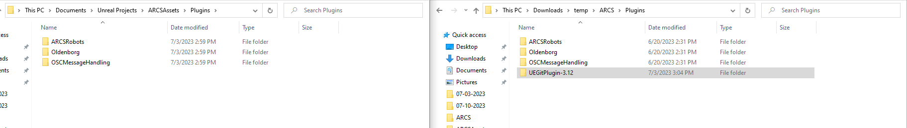
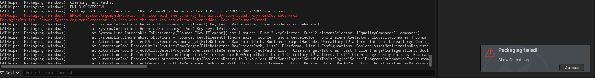
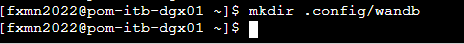
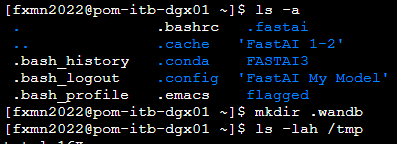
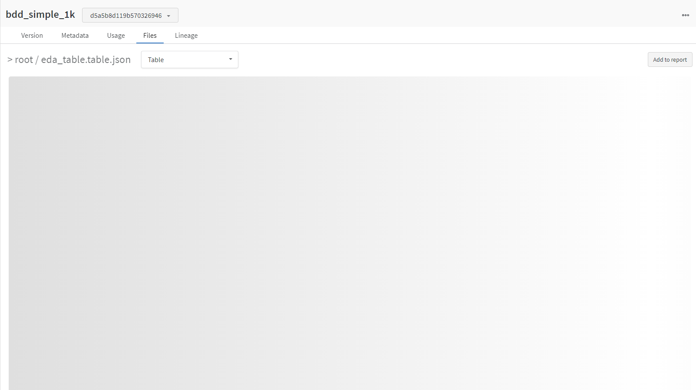

# Summary

| Date  | Notes
| :---- | :----
| 07/03 | Had a whole team meeting where we discussed our progress, and had whole group code review, worked with Anjali to fix the suggestions, tried them in unreal engine, edited the blueprint, met with Clark for another smaller code review, committed and pushed changes to ue5osc and unreal project to github and gitea respectively, I watched Youtube video on keeping blueprints organized,
| 07/04 | Watched every video in the WandB course on effective mlops models, tried following along with the videos but got a permission error, tried fixing it for a long while before eventually deciding to move on from it. Read documentation on fastai and ddg images to gather data and practice the process of collecting it and classifying. Repackaged windows and mac game.
| 07/05 | I reread the Gibson Env article and took more detailed notes, packaged the games for windows and mac, I fixed the issue and starting practicing coding with wandb, and I helped Anjali with blender and creating a scaled oldenborg
| 07/06 | Had a whole group meeting discussing Gibson Env, continued working on WandB videos and getting the code running, edited ue5osc in response to the new suggestions, went over the boxnav code and ue5osc alongside Prof Clark, and then I edited the ue blueprint to work with the new edits.
| 07/07 | Continued working on wandb code by retracing the notebooks on github, Anjali, Clark, and I then continued working on getting ue5osc and boxnav working together, after a lot of changes we had it working to some degree with the ability to start collecting data, I then shifted focus to try to tackle the new additions and changes needed in the blueprint for our next step.


---

 # Activities

- The while loop in wait_for_response does not work as Intended because we got rid of self.values and by checking for it, it'll always be false, as we are never updating it.
- We finished peer programming and editing the needed suggestions.
- We then received more feedback from Prof Clark, and I worked to continue working on them. There were some things that we left as we had like the wait_for_response and assigning self.values even though we return x, y, z.
- I started editing the blueprint to ensure it worked with all commands.
- I pulled the changes from Gitea and edited the blueprint to be up to date with my main one. I then committed my changes and pushed them.
- I watched the Youtube video on tips for organizing blueprints
    * This video talked about a multitude of tips:
    1. _Marketplace Plugins_: Plugins that make organization easier.
    2. _Reroute Nodes_: We can reroute lines to make them more readable
    3. _Sequence Nodes_: We can make branches that look more organized
    4. _Enum and Switch Cases_: Better if else statements that are more compact.
    5. Straighten Nodes (Alignment): Arrow keys, drag with mouse, or you can right click and chose align.
    6. Consistent Node Layout: Keep smaller nodes organized in a consistent manner.
    7.  Make Functions: You can create functions to make nodes less overwhelming. We can also create local variables for them.
    8. Collapse Nodes: Hides Nodes in one collapsed node area.
    9.  Set Timer by function name: Kind of works like a delay for functions.
    10. Select Node: Change variables only once.
    11. Comments: Super Useful, TEMP, FIXME, TODO, OPTIMIZE
    12. Custom Events: Super useful work like functions and allow us to get nodes in the same blueprint in its own section.
    13. Actor Components: Useful for shared functionality.
    14. Blueprint Function  Libraries: Functionality not tied to one object, kind of like utility functions. Can be called from all blueprints.
    15. Parents/Child Inheritance: Can Make changes to a child that has same properties as parent, but you can make changes to its mesh and more.
- I packaged the games for windows and MAC again after getting an error yesterday not letting me package them. I fixed this issue by going into the plugin folder and getting rid of the gitsource plugin. Once I did this, I was able to package the game.
- I then reread the article and took more detailed notes to prepare for our meeting tomorrow.



- I got help from Prof Clark to fix, my WandB notebook not working. We were able to get this working by creating the necessary directory.
- I started using blender and helping Anjali get it all to scale.
- I had my SWOT meeting with Professor Clark and was offered a position for during the semester.

- I reviewed my notes on Gibson ENv before we had a whole group meeting where we discussed it.
- I continued working on the WandB code before running into an issue where the table would never load regardless of what I tried. 
- I then continued working on the ue5osc python suggestions and got a python context manager working.
    - A python context manager is an object that manages the delivery and receipt of information associated with some code like a class for example. It allows easy handling for files, connections, and environments. It works with 
```
with <context_to_manage> as <name>
```
- Professor Clark and I troubleshot changing the screen to windowed and gettings its resolution to stay at a smaller scale of 700x500 which we had to do in the DefaultGameUserSettings.ini
- After Anjali and I finished addressing all the new suggestions we had a small code review with Professor Clark where we were able to start working on getting boxnav ready to work with ue5osc. We had a few issues getting set up and getting ue5osc downloadable to be used, but we eventually got to the point where we realized we would need to change ue5osc method names to match the older ones
- I then shifted my focus to the blueprint and got the new command names functioning.
- I continued working on my wandb project. Trying to get the artifact to work correctly. However, small issues kept appearing like the artifact not being able to accessed correctly. I was able to fix this by rerunning all my cells.
- Professor Clark, Anjali, and I then spent the next several hours working on getting ue5osc working alongside our boxnav code. Some of the changes that we made were the following:
    - able to send commands take screenshots
    - added more arguments to args parse (collect and res)
    - We reorganized the folders and paths of the boxnav files
    - fixed the import settings
    - Learned about the debugging process in visual studio code
    - We also changed our boxsim code to run commands that were in our ue5osc import instead of the old ue5realcv
    - We were then stuck on the robot not moving due to our actions which we fixed by changing the names of our functions and variables.
- I then worked on editing our blueprint to fix some of the following issues:
    - Added the ability to hide the robot from the viewport to better collect data
    - Added the command to change the resolution of the screen and the images being taken.
    - Fixed images being saved as .png.png

## WandB Effective MLOps:

- I started watching all the WandB videos for Effective MLOps.
- The focus of this course will be three different parts: the first part which is developing a simple baseline, then optimizing our solution, and finally we'll evaluate our models.
    - First Video: Frame opportunity as machine learning model. Explaratory data analysis after we have gathered our data. Then we have to decide what metrics we want to track and optimize and develop a simple solution. We want to have active communication. 
    - Second Video: pip install wandb -qq. We'll need o also import fastai.vision.all and params. We can create a table with wand.Table(columns=["File_Name", "P1", "P2", "Images", "Dataset"] + labels). Starts a run to allow computation with run = wandb.init(project=params.WANDB_PROJECT, entityparams.ENTITY, job_type="upload"). For an artifact it's a folder containing our data with artifact = wandb.Artifact(params.RAW_DATA_AT, type="raw_data"). artifact.add_file(path/"License.txt", name="License.txt"). Add folders to artifact with artifact.add_dir(path/"images", name="images") and artifact.add_dir(path/'labels', name='labels'). table= _create_table(image_files, params.BDD_CLASSES) Next we must add table to artifact log the artifact and finish the run.
    - Third Video: in artifacts tab we have man tools to look in detail at our data. Table allows us to look at our images. Segemntation tasks requires each pixel to be identified. We can create reports to document data. We can note down what attributes from each p seems to look like and what we need to pay attention to. We can add tables to our reports
    - Fourth Video: good pratice so save work of wandb to use it later. We can use the artifact to download it and save locally. Split data with EDA table. Add a table column for rare data. We can create a new artifact to store this data. Create a dataframe for a new eda table. Join it with eda, log it, and run.
    - Fifth Video: Import fastai.callback.wandb import wandbcallback. Artifacts to track the data lineage for our model.wandb.config to set up hyperparameters. 
    - Sixth Video: Summary of our first task in building a prototype. WandB tables allows us to visualize and analyze model predictions. Artifacts allow us to track lineanage of our data. Wand to record model training. Ensure that we write reports.

    - Second Lesson:
    - Learn how to optimize our model while increasing output but reducing effort
    - Learned how to get code and model from team members and get it running on our system.
    - Refactoring code refers to the process of restructuring code in a way without changing or adding to its behaviour
    - Sweeps helps with hyperparameter tuning efficiently.
    - table view and grouping by architecture makes it easier to understand and digest metrics for sweep analysis. 
    - We can use grouping, sorting, and filtering to analyze large groups of data.
    - We should use sweeps to automate hyperparameter training

    - Third Lesson: will be about data partioning, evaluation metrics, error analysis, and also documenting models.
    - Trying to prevent data leakage and ensuring we partition data correctly.
    - It's important to pick only one metric that is a single-number.
    - Person iou: intersection over union (ratio) have to be aware of imbalances
    - Model Registry allows to track and transition state of models across the lifecycle, from training, through evaluation, testing and production.
    - To evalutate models you can create an evaluation run with job_type being evaluation.
    - Error analysis is important because it allows you to see what truths may be causing errors in your models.
    - If metrics on test set are very different you must look into whether data was split in the right way, is the dataset that was split different from the other data, or is there a lot of noise? If you find an issue and decide to use another model you must completely restart and re-partition your data.

## Gibson Env:

- Developing sensorimotor models/controls is hard to do in the physical world which has pushed simulation learning.
- The method for constructing sensorimotor controllers has been tied with being fed information from an environment but the question is where this should come from.
- Simulated learning must ensure the semantic complexity to be a replicate of the real world and rendered visual observation is close enough to what a camera would capture.
- We can close the gap from real camera to rendered engine one by employing neural network based rendering which jointly trains network for making renderings look realistic and makes real images look rendered.
- Image Based Rendering can help with lighting inconsistencies and handling more difficult textures compared to rendering textured meshes.
- Scans of real spaces lead to a sparse set of sampled lighting but are prevented from simply rendering from textured meshes so these images are transformed with rigid body transformations.
- I am a bit confused on the backpropogation technique that they use where they initilize half of the weights, freeze them, and optimize them.
- Goggles are way the camera is able to see through corrective glasses to see the real world in a way more corresponding to the rendered Image in Gibson
- They used perceptual tasks and static-recogntiion tasks to validate Gibson and to help train it to avoid obstacles through a stream of depth RGB frames.
- They trained a neural network for depth estimation using the images of each database and test them on real images.They then perform scene classification on randomly picked images and report the entropy of the distribution of top-1 classes for each env.

- Meeting On Gibson Env:
    - The problem is that we want robots to work in a real space without having to use the costly resources.
    - Talked about what backpropogation refers to and how we can't truly know why they did what they did without reading their sources.
    - 

# Issues

- Even if we try to run the wandb code, we are unable to. Everytime we try to login to it we get an error that says permission denied. PermissionError: [Errno 13] Permission denied: '/tmp/.config/wandb/tmps41l9oko.tmp'
- I tried packaging the games as the blueprint is working with our current ue5osc python script, but got that the packaging failed. UATHelper: Packaging (Windows): ERROR: System.ArgumentException: An item with the same key has already been added. Key: GitSourceControl
PackagingResults: Error: System.ArgumentException: An item with the same key has already been added. Key: GitSourceControl




- Issue with WandB where I was unable to run any code with it or even login because it was unable to make a temp dir. We fixed this with the following commands:





- Facing an error where the tables needed never load in. They just infinitely load. I tried running the website on a different device the problem persisted.



- This turned out to be an issue with the webpage itself and after a while it fixed itself. 
# Plans

- In Unreal:
    - set port
    - add commands to set resolution
    - camera collisions
    - add command to change texture quality
    - make resolution the same between screenshots and screen
