# Summary

| Date  | Notes
| :---- | :----
| 07/10 | I looked into adding more settings into gameusersettings.ini in order to allow anyone to change the server and client port the OSC uses, I found a way to get it working with C++, bu then shifted focus to reading documentation to somehow get it to work with solely blueprints, I created a second camera for a view without the robot, I fixed the issue of boxnav screenshots not saving to the correct directory, I added button and commands to change the graphics quality.
| 07/11 | I read the iGibson article and took notes on it, discussed the article and its applications with Anjali, watched Youtube tutorials on raycasting and built a simple raycast that checks in front of the robot whether it's next move will cause it to hit the wall, I then worked with Anjali and Professor clark to fix the boxnav code getting it to finally die gracefully and be less redundant, Anjali and I then took all the necessary coordinates from unreal engine and started remaking the boxes, and finally I edited the blueprints and packaged the game for all versions.
| 07/12 | Had a whole team meeting where we discussed our progress from last week and went over the ue5osc code as well as boxnav, we fixed some confusing portions of the code and edited it so it would work on both mac and windows, I then worked on getting the raycast to work to avoid movement into walls, lastly Anjali and I heauristically fixed the boxes in boxsim.py after reading the box.py code and being a bit confused.
| 07/13 | 
| 07/14 | 

# Activities

- I began looking into ways to add more custom settings into GameUserSettings.ini file and I found a way using C++. I decided to try to implement it following along with this YouTube tutorial. It ended up working; however, when I tried packaging the game for windows it ended up taking an incredibly long time. 
    - Below I have included an image of the simple blueprint that I made that enabled the usage of custom config settings:

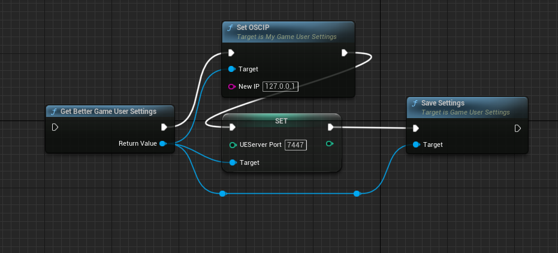

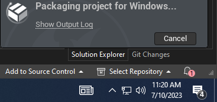

- I got an unknown Cook failure when packaging the game, so I shifted to trying to see how I could make it into a plugin. Prof Clark, then recommended I shift focuses away from that since a plugin would require the team to have to download the same sdk and make the workflow more complicated.

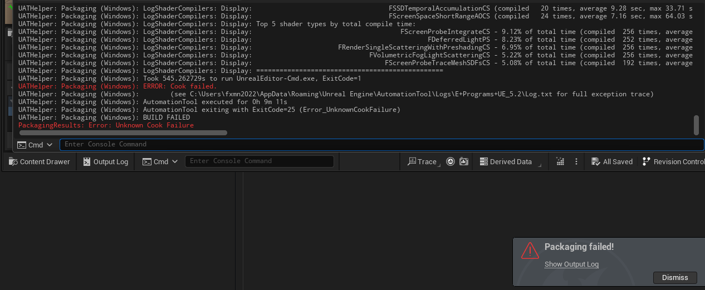

- I added a second camera to the pawn where we could chose between two options. One where the robot is in the view and one where it is not. Originally, I had this system working with adding an offset to the camera, but Clark's recommendation was more concise so I implemented it. 

    - Below I have my original system which simply moved the camera ahead of the robot and fixed it's slant to be level.
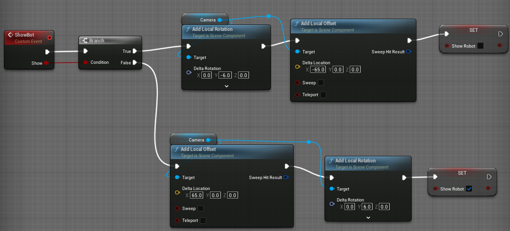

    - This is the system that Clark recommended that was more concise and easier to understand.

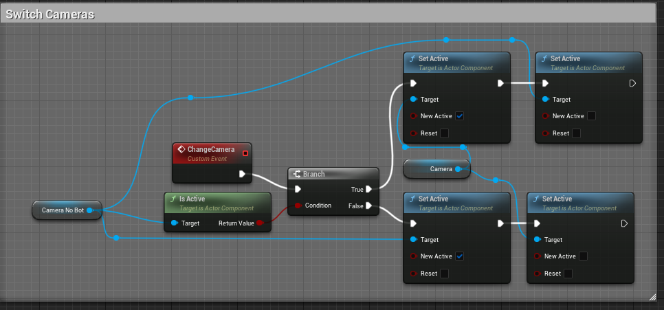

- I added an option to change the graphics quality with the press of comma to decrease the graphic settings, and period to increase the graphics quality. These options allow 4 different graphics settings.

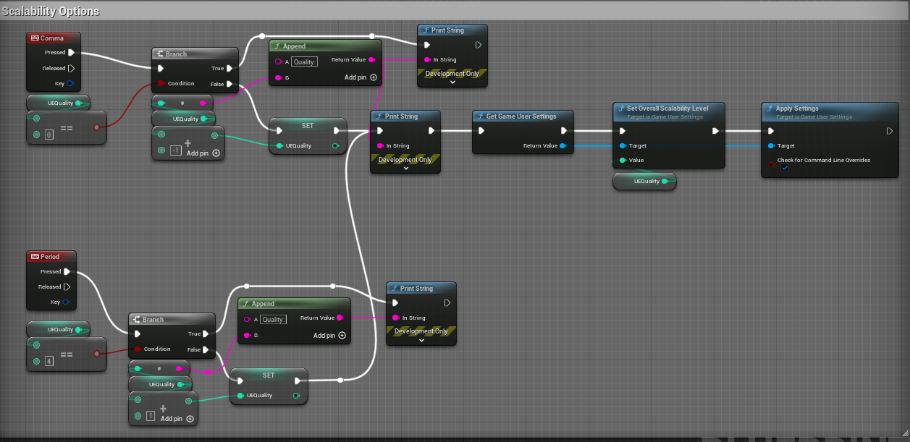

- I then started reading more documentation and watching youtube tutorials on getting custom game settings readable through blueprints. Unfortunately, I haven't found anything just yet.
- I decided to look into the screenshots not being saved where we wanted them, and after comparing my osc code (where screenshots were saved where ever I wanted) and the boxnav code I found that the filepath was off by including a backslash instead of a slash in separating the folder and filename. After I fixed this, Anjali pushed and commited the changes. 

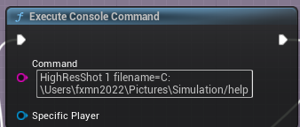

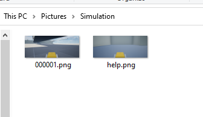

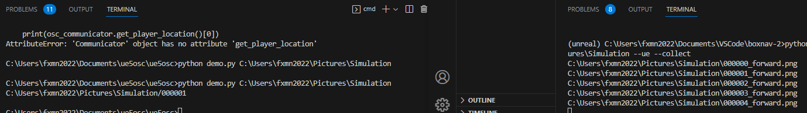

- I started reading the research paper. I took notes on the reading as specified in the google doc. Me and Anjali then met and started discussing the paper and our thoughts on it.
- I watched a youtube tutorial on what raycasting refers to and looked at some of the code in our blueprint to identify how we can implement it.
- I found the necessary nodes and then read some documentation on break on hit to be able to identify what world dynamic object our pawn is to hit in a straight line. 
- Using this, I plan to identify a way in which we can prevent the robot from falling off the map.
    - We can accomplish this with the following: If we are going forward cast trace and if distance of the hit is larger than the trace then we just want to move to the end of the trace
    - Get location of the hit when we need to move and make that our new location.

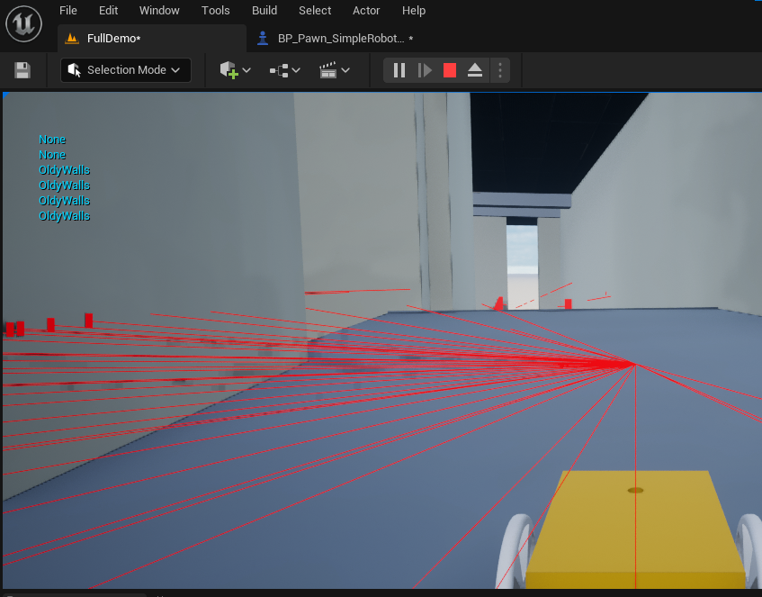

- I can make a Powershell script to compile and move the plugin in and out automatically.
- Following this Anjali, Clark, and I worked on making our python code die gracefully with a try and exception as well as reducing the redudancy in our method calls.
- Anjali and I then focused on getting the coordinates of all the walls in Oldenburg to fix the points in the boxsim.py code.
-  I packaged the current game for windows, mac, and uploaded all the zips into slack, and posted a whole change log for the group.

- We all met and had a whole group meeting discussing our progress from the previous week and fixing our boxnav code and ue5osc. 
- We then went over what parts were working or were confusing and edited them.
- Anjali and I got boxnav and ue5osc updated with the new line of code that Prof Clark suggested, and then we commited those changes.
- I then started focusing on the unreal engine portion and getting the raycast to prevent movement inside of the walls while still allowing the robot to move backwards.
    - I used the distance output pin from break on hit to determine the length of the raycast line and made it's length the distance our robot should travel instead, if it's original distance would've brought it outside of bounds.

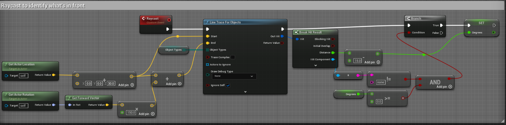

- Anjali and I then had to heauristically fix each and every box to be aligned correctly to what the dimensions in unreal engine are.

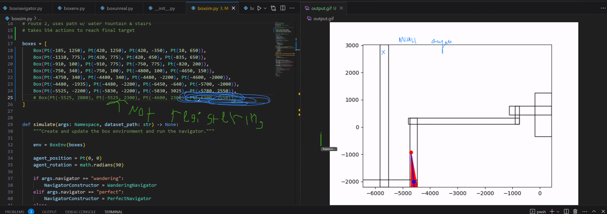

- I practiced using WandB and kept building my model to analyze. I faced an issue where my model was giving me a split error, and so I had to rerun and delete my runs to hope that it would be fixed. This issue persisted, so I pulled up the github notebook side by side to my code and realized I was missing these 3 lines of codes. After I added them, my model was able to be trained.

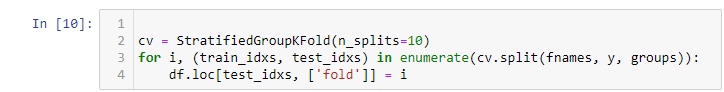

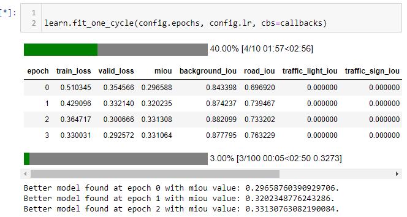

- Following this Anjali and I met with Daisy, and tested a lot of the different functions on MacOs as well as walking her through how the different commands work. Luckily, it looks like all the different commands work as expected with little to no issues.
- Anjali and I met and brainstormed topics that we wanted to discuss in our meeting next wednesday with Oliver. We chronologically wrote everything that we have already accomplished and split up what each of us would talk about. 
    - Prof Clark, then walked in and we discussed what topics we should include, how long it should be, and some reasons as to the choices that we've made to end up using unreal engine and pythonosc.
    - We created some slides and planned out what we want to include in our demo video. Before recording this demo video I went into the blueprint and made some final changes including finding out we can in fact save images as .jpg and not just as .png

        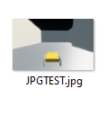

- Anjali and I then changed the way boxnav saved images. Instead of simply attaching the label, we decided to also attach the degree of the rotation that boxnav told the agent to move.

# iGibson 2.0: Object-Centric

- Everyone should write a 1 to 5 sentence summary of the article.
    - This article is about iGibson 2.0 a simulated environment that has support for more semantically relevant tasks and operations with predicates that not only hold binary states but their transitions process as well. Their object-centric represenation of object states allows for a much deeper and robust connection to reality that bridges that gap between simulation and the real world. Furthermore, they help address the issue of simulations skewing research towards simply movement and physical interactions.
- How does this paper relate to our lab’s work?
    - This paper relates to our lab's work through building simulation environments that allow for a collection of data and features that help make data collection more variable for easy training.
- What techniques should we apply to our work?
    - We could possibly apply some of these values of predicates to our work. For example, have binary states and process states for forces such as gravity, friction, collisions, and or reflections. Simply focusing on movement, like they addressed will lead to biased and skewed data eventually, so it might be good to look into somehow applying these states to our simulation.
- What could the authors have done better?
    - The authors could've partly talked about their process creating the environment it feels like they talked about what it could do, what features it has, and what makes it different. It is open-source meaning everyone can look at it. So a section where they at least go into some broad overview over their process creating it would've been insightful and might've made their research paper much stronger. 
- Questions:
    - When it talks about logical predicates what does this mean exactly?
        - Refersto the binary logical predicates that map to logical states connected to semantics.
    - These semantic rules that they keep bringing up. Do they define them themselves and if so on what basis? Are they training them to learn these rules or are they just programmed.

- As simulations become more prominent in training robot learning we have had skewed attention towards motion and physical contact instead of more semantically relevant tasks.
- Tackling a new simulation env that can maintain updated new types of object states that can broaden area to study.
- Different from AI2Thor and VirtualHome because they have predefined preconditions and postconditions. iGibson doesn't only hold a symbolic state but provides a simple simulation of the process.
- They have limitations in the form of semantic gaps between extended states and natural descriptions of activities in a household setup. In order to make up for this they define a set of functions that map the extended object states to logical states. 

# Issues

- I was having a problem where the command to switch between camera views wasn't working on the first attempt, but would work normally after the second try. I fixed this by setting the camera without the robot as inactive at the very beginning of the game.
- We faced an issue while trying to fix the boxes in boxsim.py. It appeared that the code for the creation of the boxes isn't consistent nor well documented and so Anjali and I were confused as to how we should edit the separate coordiantes since even after measuring unreal engine's corner's they would for some reason never show up as expected on the boxsim.py
- WandB code was not running and kept giving me an error about a key error and an issue with splitting. I was able to fix it by realizing I was missing 3 lines of code in my second artifact.