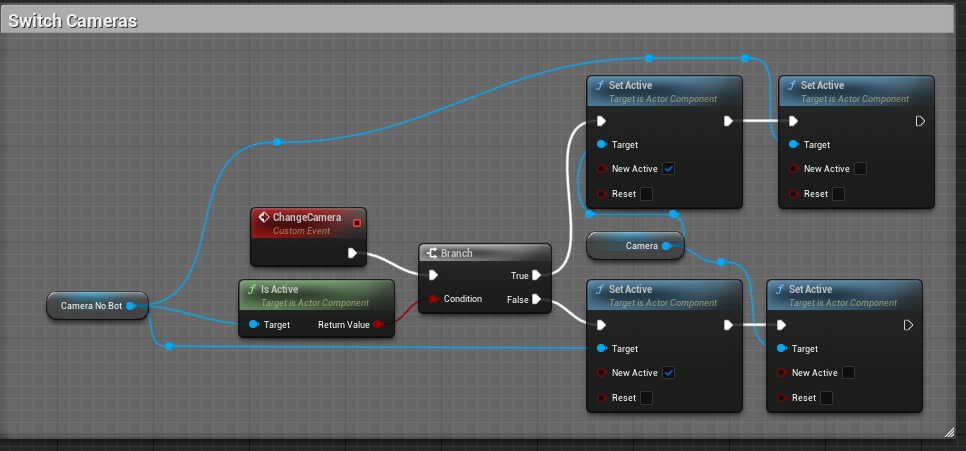

# Summary

| Date  | Notes
| :---- | :----
| 07/17 | Had a whole team meeting where we discussed the iGibson 2.0 article, explained how boxnav work, and how we can use it/set it up, worked on updating the readme for boxnav, met with Anjali and further discussed ideas for Wednesday, uploaded zoom meetings, committed changes to ue5osc and boxnav as requested from Prof Clark, before focusing on the blueprint and getting switching texture's working without development mode.
| 07/18 | Had a meeting with Chau and Daisy about creating a wandB artifact, continued working on trying to get cross blueprint communication before shifting focus, and instead packing the game for mac and window and committing all my changes to github, Anjali and I then addressed the suggestions to change the filename, I then wanted to collected more data by creating multiple runs to collect images, Anjali and I then spent the rest of the day practicing for our presentation, recording and editing a demo video as well as uploading it.
| 07/19 | Had a team meeting with Oliver and the UCSC team where Anjali and I presented what our research has been so far, as well as demoed our project, Anjali and I then began working on a system to allow multiple runs with an argument, Prof Clark then helped us revise this code and improve upon it, I then created a large dataset with over 1800 images and uploaded it as an artifact to wandb, I then spent some time watching the OSC Youtube videos, and modeling Edmunds in blender. 
| 07/20 | Got the cross blueprint communication working, ran boxnav and started to collect more images, had a meeting with Prof Clark and Anjali about next steps in our research, helped Anjali with debugging her wandb code, started working on the UE blueprint to get the wandering navigator to work as intended.
| 07/21 | I continued working on getting the wandering navigator to work as intended, I kept bumping into an error where the raycast length would not be updated, but I fixed it. The code appeared to be working as intended preventing movements into walls; however, Anjali and I realized that we would continuously get errors saying the agent has exited the boxes, so we spent some more time trying to fix that. Furthermore, Anjali and I looked into the Oldenborg training python script and made some edits.

# Activities

- Had a whole team meeting where we discussed the iGibson paper.
    - We talked about why we are working on our research and how our research differs from other robotic research on the same topic.
- Eventually put some people and or change more things in the environment and see how our neural network/machine learning model reacts.
- See what changes in the environment will cause it to act erratically or be prone to errors.
- We talked about unsupervised learning and how it works in assigning points.
- Get wandB working, and understanding it. every 20 steps, training some models, some inference on a really bad model
- After the main whole group meeting, Daisy, Chau, Anjali, and I stayed in the call where we went over all of the code in boxnav, explained how it generally works as well as some of the lower level details. 
    - We then ran the code and showed how it's supposed to function
    - Prof Clark, then showed everyone how they should go about creating an env to allow anyone to run boxsim.py
    - Chau then stayed in the call and helped me identify where the game.ini file could be located on Mac
- I then started working on the README in boxnav.
- Met with Chau and Daisy. We worked out how to create an artifact and uploaded it to wandb teams.
    - Recorded and put into box
- Kept trying to figure out how to use blueprint to change the texture without console; however, eventually had to give up due to not understanding the object needed.
- I packaged the current version of unreal engine and committed my files into github, as to start collecting data.
- Anjali and I then worked on changing the filename in boxnav to include the degree instead of the previous action taken.
- We shifted focus to practicing our presentation for tomorrow's meeting 
    - We recorded and edited our demo project to present tomorrow.
- Furthermore I started exploring a way to have multiple runs of the environment in order to allow us to gather bigger datasets.
    - The first method that I created used a global variable and was overall very clunky, so I disposed of it after realizing it also only took images up to 300 before overwriting all of them.
- Following our presentation to UCSD Anjali and I started working on a more permanent way to specify the number of runs in boxnav. 
    - We implemented it by returning the last index of the images saved, and then starting at this index in a for loop where we continously ran simulate. 
    - Prof Clark, then helped us do a code review where we added the number of trials which fixed the issue of overwriting and also allowed us to separate each run into it's own set of images.
- I then ran this code for 10 trials and collected 1800 images, all of which I uploaded to wandb as an artifact.
- I then began modeling Edmunds to see how blender exporting worked. Unfortunately, the meshes would bug out over and over again.
- I worked on Unreal Engine trying to get cross blueprint communication, so we would be able to change the texture of the walls without having to have the game packaged in debug mode.
    - I finally got it working through a blueprint interface
- Anjali, Prof Clark, and I then met and discussed what our objectives should be for the upcoming week. We looked at the Oldenborg training repository and made some comments so we knew what to do.
    - We also briefly talked on getting the wandering navigator to be more effective and not unsync the robot or fall of the map.
    - I proposed the idea of sending a raycast before an action is executed to tell python that the action is proposed is not valid.
    - I then spent the rest of the day trying to implement it.
- I continued working on the wandering navigator to try to get it working through raycasts; however, I kept bumping into errors. 
    - I eventually was able to get through and get a semi-working wandering navigator. However, I soon realized it would often get stuck in corners, so to combat this Anjali and I tried making a system where if certain movements were prevented for 5 times in a row we would end the trial early and say it got stuck. This code caused some issues with our messy code by comparing it's location from it's first movement to its 5th.
    - I also learned that the raycasting prevention method of movement might've only been acting on the unreal engine side and not boxnav, so I spent the rest of the day trying to figure it out but was unsuccessful.

- Anjali and I also worked on the Oldenborg training python script.
    - We added some argument parsers, made some comments, and fixed the labeling of images.

# Issues

- After modeling Edmunds in Blender, I had an issue with collisions where every time I walked into the model, the model would start to glitch out.
- Raycast length variable kept getting reset to the default value even though unreal engine was in fact receiving a new value and storing it for a few seconds. I fixed this by moving where I set the raycast length. I'm still not sure as to why this fixed it though.
- I can't seem to get our unreal engine raycast to prevent an action in python. It appears to only prevent it in unreal engine.

# Plans

- Split up OSC and the pawn
    - Then make an interace to communicate with all 3.
- I need to continue fixing the wandering navigator and getting it to always be lined up with the animation/box environment.
    - It might be easier to meet with Clark for a bit and discuss where the box env is getting the command to move forward because it appears even when I prevent the command from happening in unreal engine it still happens in the box env.