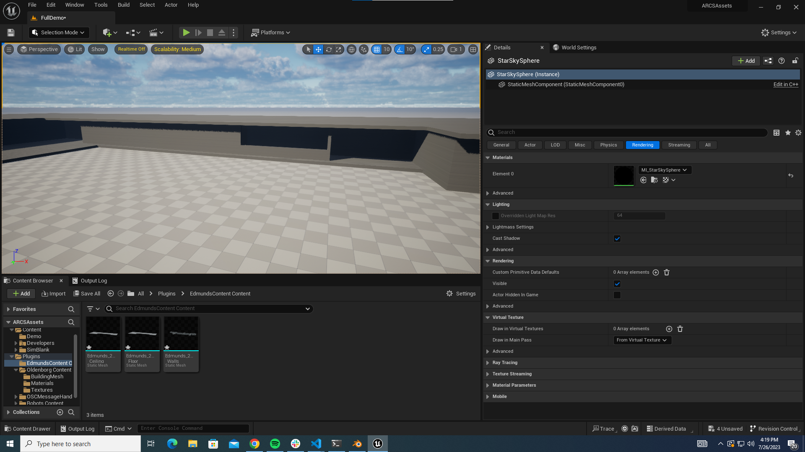
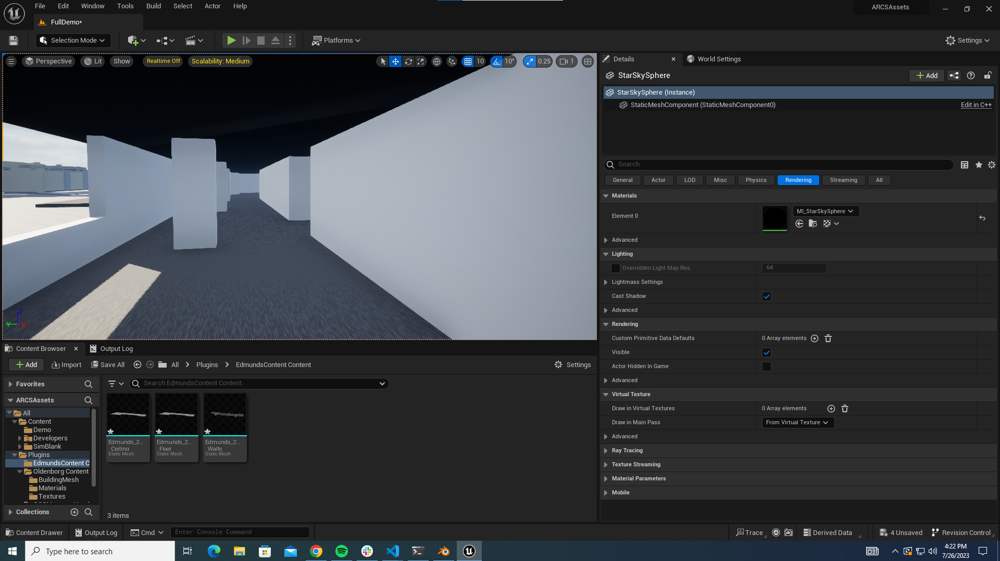
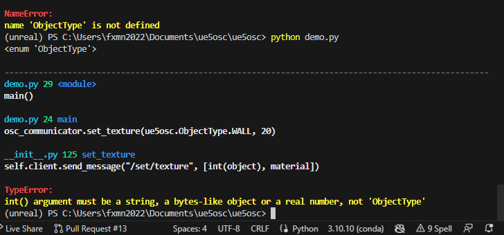
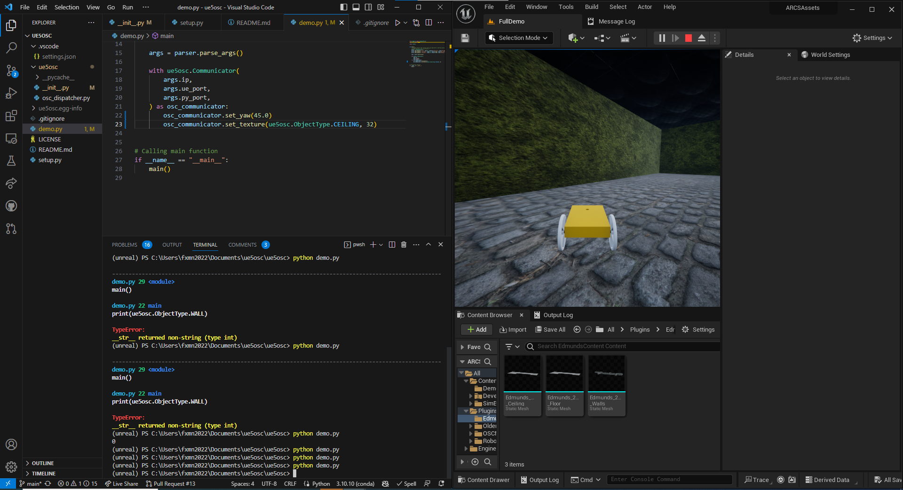

# Summary

| Date  | Notes
| :---- | :----
| 07/24 | Had a whole group meeting with Daisy, Chau, Anjali, and Ella. In this meeting we went over the code and objectives in the OldenborgTraining repository. Here we also split up the work between 2 groups. Anjali and I decided to focus on fixing the wandering navigator and getting us less likely to get stuck 
| 07/25 | Had another whole group meeting where we dicussed our progress from the previous meeting, worked on the boxnav code for most of the day trying to get the wandering navigator not only more consistent, but useful in collecting helpful information. After, getting to the point where it felt the wandering navigator was a bit more helpful, Anjali and I began to work on inference.py until we got it working with a basic trained model. We stopped at getting unreal engine to take a screenshot and getting our NN to make a decision based off of it. 
| 07/26 | We had another whole group meeting where I talked about the changes that I made in boxnav and the wandering navigator, Chau then explained what they were doing with Image+Command and the point where they we at with it. Anjali then explained our inference.py work and we adjourned with the goal of combining both of our parts the next day. Anjali and I began to work on the inference.py and trying to get it working with different models as well as allowing unreal engine to take an action for certain amount of moves. I then trained more datasets on the wandering navigator, and got the edmunds model that I made in blender into unreal engine and working as intended.
| 07/27 | Had a whole group meeting with Chau, Daisy, and Ella where we once again discussed our progress, I showed them how inference.py was working and ready for their model, showed them how blender can be used for unreal engine modeling, worked on making edits to my pull requests, debugged some code, and looked into why image+command was not working.
| 07/28 | Had a whole team meeting where we tried getting our Image+command model working with our inference.py script; however, it would not work so we started debugging and reading documentation on the exporting and loading process, but could still not make it work. I read some documentation and watched some videos on LIDAR data, and addressed the suggestions on our pull requests.

# Activities

- Need to work on inference.py to actually be able to make the agent act on our NN decisions.
- Fix the wandering path to work as intended.
- Work on training.py to create a model that works with the Image+Command model.
- Ella, Chau, and Daisy will work on getting the server GPU's working and coding an Image+Command model
- Anjali and I will work on the boxnav wandering navigator and get it work as intended.
- Continued working on boxnav and fixed the ValueError from happening when the robot tried going outside of the circle. We simply commented out this line since if it failed anyway, it's position wouldn't be updated. Furthermore, since UE wouldn't move if this was the case the robots would still stay synced.

- Had a whole team meeting again with Chau, Daisy, and Ella. In this meeting we discussed our progress from what we did yesterday. It was short meeting, but insightful as to what we were each working on.
- Once again today, I continued attempting to make the wandering navigator a bit more consistent with being able to reach the finish. 
    - The first thing the I decided to address were the problem areas. These problem areas where places where the robot would like wandering into the corners and getting stuck. To fix these problem areas, I placed an invisible wall that should prevent the unreal robot from continuously thinking it was a valid path.
    - Next, I realized the certain places in the boxsim env were treated as being valid paths when in reality they were actually inside the walls or out of bounds. To fix this, I made some of the hallways a bit skinnier in the boxsim.
    - Another thing that I did was increase the opportunities for invalid actions to 10 instead of just 5 to see if it would lead to us reaching a valid move.      
    - Furthermore, I fixed the method call for syncing the boxsim agent to unreal agent, so the Boxsim agent wouldn't make a move away from the actual robot.

- Anjali and I then began to focus on getting inference.py to work with a simple model. 
    - The first step in assigning pictures to the ones we took in unreal engine was pretty simple, and then following this we implemented a way to pull a requested image and have a model make a prediction on what we should do next, which worked.

- Had a whole team meeting with everyone once again where we discussed our progress and explained our approach and thought process. 
- We talked about how we got inference.py to work with a simple trained model, and then explained how we improved the wandering navigator to get stuck less often and be more likely to reach the end.
    - Chau, Daisy, and Anjali then explained their image+command code, how they changed it, and what their next steps are.
- Next steps:
    - Look into pth vs. pkl files: Liz and Christy were saving it originally as a pth.
    - Passing image+command into inference.py
    - Fix naming convention
    - Let unreal engine move the agent based on it's decision.
    - Enhancing image+command. Looking into more metrics. Sweeps.
- I uploaded this meeting and yesterday's into box.
- Anjali and I began looking more into the inference.py and trying to get it working with the image+command before being told that we shouldn't use it yet as it was not ready. Due to this we shited focus and began trying to get the unreal communication and repetitive actions going based on the model's decision. It turned out the model was always biased towards going forward based on the information from the perfect navigator.
- To counteract this we created a dataset of over 2k images with randomized texture from the wandering navigator. This navigator actually ended up performing better, it just kept getting stuck in endless repeating loops, such as turning left, after turning right and so on. 
- Anjali and I decided this was an issue with the model that would shortly be fixed with the Image+command model.
- I then continued trying to get the Edmunds model that I had previously built to be exported into unreal engine as a valid model that a robot would be able to traverse through. I was able to fix the clipping issue by untoggling the import missing collisions.

- We had another full group meeting where we discussed our work from Wednesday. Chau, Daisy, and Ella went over how they fixed their code.
    - While I explained how our inference.py is now able to communicate with unreal engine through commands that it's neural network makes.
    - I also very briefly touched on exporting models from unreal engine and importing them into unreal engine.
- I then started looking at the suggestions and edits that were left on our pull requests and editing the code to address them.
    - Once I finished addressing all the suggestions, I tried looking into the image+command model that we are attempting to train based on the other groups code and trying to fix it.
    - No matter what I tried I wasn't even able to get this model to fully run. That was until I realized that I was in the wrong environment and after changing into the right one it was working as intended.
    - While addressing some of the suggestions, I tried implementing an enum class; however, I kept getting an error not knowing how to get this enum to return an int as the value and not the custom class. I was able to fix this with IntEnum
    
    

    
    
- Had a whole team meeting where we really explored how to get Image+Command's model working with our inference.py file. Unfortunately, we could not debug it and instead wrote down all of our errors to talk about them on Monday once Clark is back in the office. 
- I read some documentation on torch.save vs learn.export() and tried comparing our two training models and seeing why the image+command was failing.
    - Christy left a helpful comment that recommended we got rid of the callback function since it might be the reason we fail to export into a pkl file.
- I then looked at all the comments that Prof Clark left on my open pull requests and made new commits as needed. 
- After this I watched some videos on Lidar and just tried understanding a bit on how it works and could be implemented into Unreal Engine.

# Issues

- While running the new wandering navigator I noticed a few issues:
    - The robot camera could sometimes clip through the walls and see right through them. I can fix this by decreasing the movement forward by a fixed amount if its raycast hits something, or I can move the camera a bit further back.
    - Although we reset correctly, it resets to often, rarely getting to the final target. Out of 15 trials only 4 of them ever made it to the target
        - Maybe this can be fixed by adding some invisible walls that can prevent the wandering robot going into positions it is prone to getting stuck inside of.
- I ran into an issue when I was editing the boxnav code. I was attempting to move the set_raycast_length from the take_action method into somewhere where it wouldn't be called every time we wanted to take an action. At first, I tried changing it where our class was intialized; however, this did not work at all. I kept trying to change it's position until I eventually figured to move it into boxsim.py where it would be called before we take our action. 
- I also ran into another issue where I kept getting an error where the inference.py file could not instatiate PosixPath on our system. 
    - I wasn't able to fully get rid of it, but I was able to make it a bit better by removing the temp statement.

# Plans

- I hope to be able to finish getting Image+command working by next week monday. 
- Show the team all my progress and leave it at a point where I am able to take a short break for a while and come back and still understand it.
- I also want to have a working training script that can train on the fly with whatever dataset one wants.