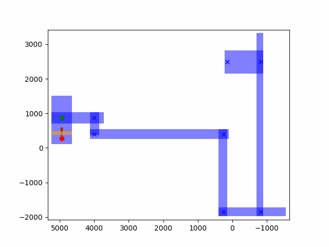

# Summary

| Date  | Notes
| :---- | :----
| 09/21 | Had a meeting with Clark where we discussed plans for our week.
| 09/23 | Recorded a video on using Blender for building environments, updated Unreal Engine 5, and looked into the teleporting navigator. 

# Activities

- Finished recording a quick tutorial on using Blender to model a 3D environment and then exporting that into UE5 with collisions.  
- Read over my teleporting navigator code, reminding myself what certain lines of code did what.
- I was able to fix an issue with the teleporting box that would shift directly based on the agent's coordinates which caused the box to sometimes jut out of the walls. I was able to fix this by changing the center point for the boxes ahead to be based on the agent's current box's upper, lower, left, and rightmost coordinates.

- I then made a function that returned a random point within this newly drawn box.
- I then added this into the main navigator method and tried to make it call teleport; however, it is still at an unfinished state.

# Issues

- Thinking of a way to incorporate correction action in order to allow the agent to use teleportation to a random position in higher levels was pretty difficult.
- The base navigator class, doesn't want to recognize TELEPORT as a valid action after I've already added it.

# Plans

- Fix Teleport Navigator and make it so TELEPORT is recognized as a valid action.

