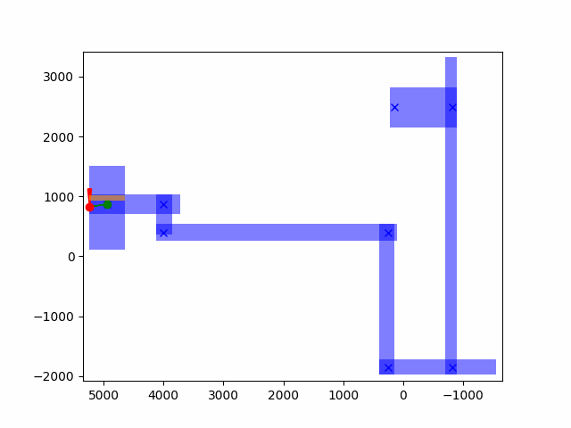
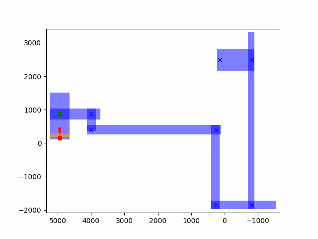

# Summary

| Date  | Notes
| :---- | :----
| 09/28 | Had a meeting with Clark, Liz, and Christy where we went over some progress in the training of models. 
| 09/30 | Worked on the teleporting navigator and debugging a lot of it to get it actually teleporting into valid points.

# Activities

- I attempted to run the teleporting navigator to see what error I was getting, and it was not recognizing the command I was sending as an action
    - This was because whenever the action was being returned it, it wasn't being read as TELEPORT but instead <TELEPORT 4>. I fixed this by simply making sure I always return Action.TELEPORT since there is no other possible action for me to take.
- When I then tried running this, I kept getting another error that my ahead_box which I was using as my valid teleporting place did not have a valid left and right bound. I wasn't sure why this was, so I tried with just my current box and got the following:

- This showed me that my code in theory worked it was just a problem with the way that I was calling it. 
- I was able to fix this by testing whether it was recognizing that ahead_box had a value and I realized that it didn't have a value on the first move because of the way display is called. I changed my code such that we would still have a value for the first movement.
    - After making this small change the code actually started running; however, then came the next issue. The agent would teleport past the target.
- I simply made it so we raised a flag once we have a teleportation box with the target inside and made the teleporting threshold a bit smaller. This allowed for the agent to simply keep teleporting in the same box until it overlapped with the target.

# Issues

- Action.TELEPORT wasn't being recognized
    - Fixed by simply returning Action.TELEPORT explicitly 
- Left bounds of my boxes weren't being read.
    - Fixed by changing the order of calls such that a value was still given on the first movement.
- Agent teleported past target.
    - Fixed by raising a flag and decreasing the teleporting threshold.

# Plans

- It looks like sometimes that teleportation boxes become a bit messed up and the distance between them randomly changes for no apparent reason. I want to figure out why this is and make it so it consistently teleports every run.
- I want to make it so our agent actually rotates after each teleport instead of just move. 
- I want to edit my system for making sure we hit each target before moving on. Maybe make it so after certain moves we always teleport on top of the target, or if we go past it our teleport box is based on the angle to the target.

