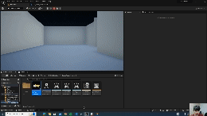
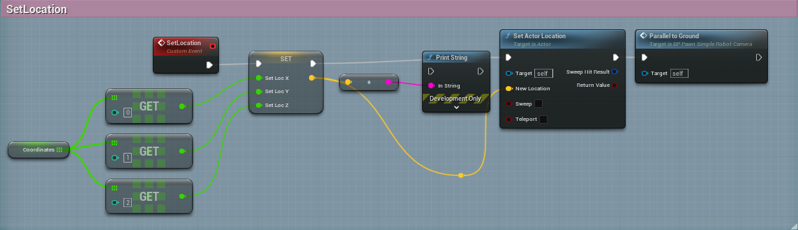
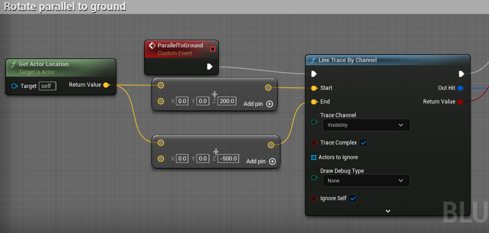
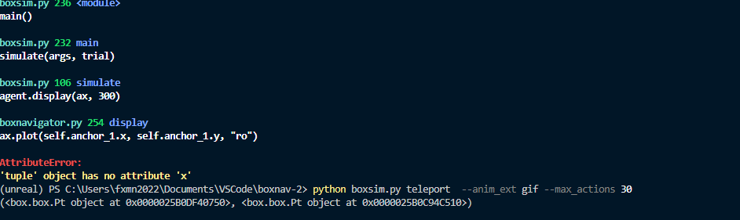
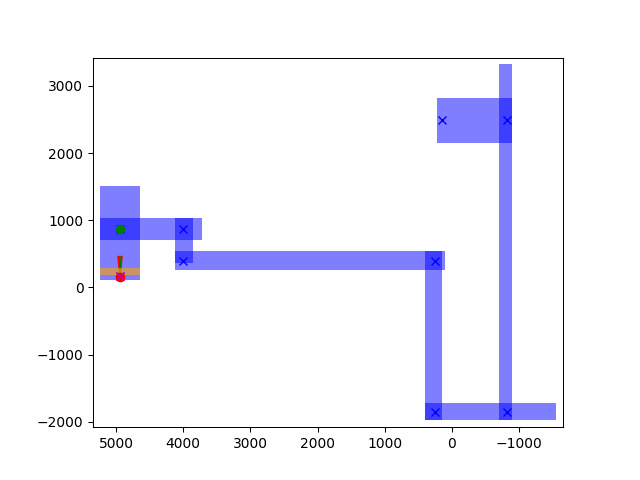

# Summary

| Date  | Notes
| :---- | :----
| 10/15 | Worked on a blogpost for packaging a game in Unreal Engine 5+, edited the UE5+ blueprint to allow teleporting to work consistently, and began to add a way to calculate a rotation.

# Activities

- Started working on a blogpost detailing how to package a game for Unreal Engine 5+. Finished the windows sections, and then went to Edmunds to finish packaging the game for MacOS.

- Continued working on the teleporting navigator. Found that teleporting would cause the robot to teleport underneath the floor.

- In order to fix this, I added a node to the blueprint that rotated it parallel to the ground with every teleportation movement. However, this only worked on half of the environment because the elevation in the beginning is too high.

- I addressed this issue by changing the positive z value in the node checking for area's above the agent by 100.

- I then shifted my focus to getting Boxnav's agent rotating. I decided to approach this with two anchor points and using these as a cone that allows for a rotation in that direction. I ran into an issue where Pts were not being recognized as tuples and were instead being made into Objects. I fixed this with a lot of trial and error that ended up being due to the way I was trying to return two points. I had to make a list of points instead.

# Issues

- The anchor points were being really finicking and were not being recognized as points. Resolved as mentioned above.

# Plans

- I will continue working on the teleporting rotation, and finish the MacOS version of the blogpost. 
- I will then share the packaged games for Mac and Windows.