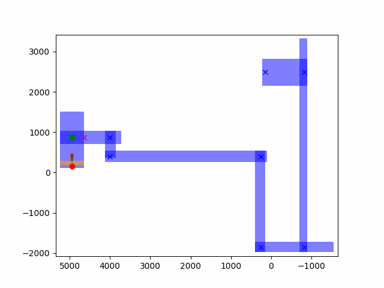
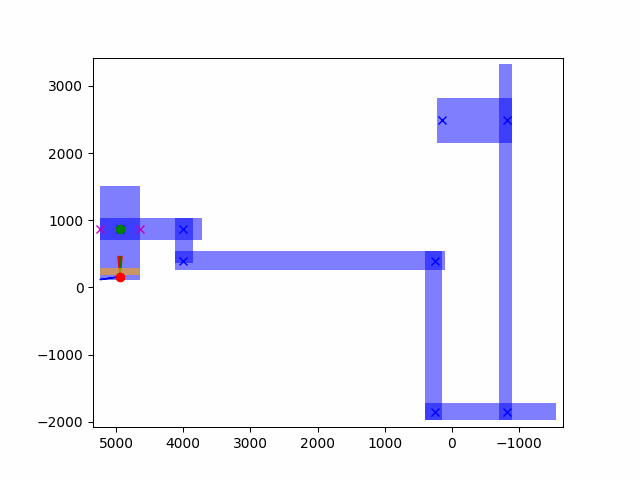
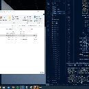

# Summary

| Date  | Notes
| :---- | :----
| 10/22 | Continued working on the teleporting navigator, got rotations working, and fixed minor issues where box would sometimes ignore target. Emailed Corey.

# Activities

- Focused on getting the rotations working for the teleporting navigator in Boxnav and Unreal Engine. 
    - Originally was having the anchor points being placed in incorrect locations; however, this was easily fixed when I realized that I had switched where anchors should be placed based on our direction. Meaning I was placing them where they would normally go if we were moving north/south instead of East/west.

    - Error:

    

- I then started facing an issue where I was attempting to think of ways to calculate a rotation between these points. I ended up creating a random point between these anchor's and finding the angle from our agent to them.
    - However, before this I was attempting to make a wedge from the agent as our center to both anchors. However, this wouldn't work no matter how many changes I made. You can see this version below:

    

    - Below is our current working version!

    
    

- I then implemented sync_rotation into BoxUnreal.py which allowed for Unreal Engine to display our rotations as intended.

    

# Issues

- Wedges were not working with my angles between my anchors which I used to calculate an angle to rotate to.
- Sometimes the agent in Unreal Engine clips through the wall. I can easily fix this by making this main hallway a bit thinner.

# Plans

- I want to fix the placement of my boxes that validate a location area. I want to make it such that we will never end up with any gaps where we can't ever teleport to. This is a rare occurrence, but will allow for consistent testing through multiple trials.
- I also want to get this packaged onto mac as soon as we fix the XCode issue.